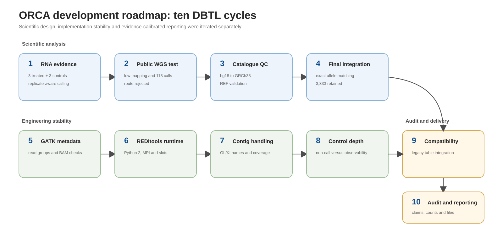

# ORCA Design–Build–Test–Learn record

This folder records how ORCA developed from an RNA-seq screening idea into an auditable transcriptome-wide C-to-U evidence pipeline and then into a label-generation interface for downstream LAMAR training. The wiki presents the finished method and results; this folder preserves the iterative analysis, implementation changes, failures and decisions.

## Objective

Identify transcript-oriented C-to-U screening candidates that were called reproducibly in three treated libraries, not called in three controls under the original REDItools2 settings, consistent with transcript strand and absent from the harmonized 293T catalogue by exact allele. Then recover direct six-sample base counts so Model 2 can use continuous, background-corrected editing labels rather than caller presence alone.

The frozen 3,333-site set remains a screening set because the legacy table does not contain independent control-site depth and base counts for control non-calls. Cycle 11 adds the executable route required to regenerate those counts from the BAM files.



## Twelve cycles

| Cycle | Question | Test | Decision |
|---|---|---|---|
| [1](cycle-1-rna-evidence.md) | Can RNA-seq provide reproducible editing evidence? | Process three treated and three control libraries independently | Retain replicate-aware RNA evidence |
| [2](cycle-2-public-wgs.md) | Can public WGS provide a genomic blacklist? | Align and filter three public WGS runs | Reject the route because mapping and variant yield were inadequate |
| [3](cycle-3-catalogue-harmonization.md) | Can `293T_CG` replace the failed WGS route? | Convert hg18 to GRCh38 and validate REF alleles | Adopt the catalogue with quality-control safeguards |
| [4](cycle-4-final-integration.md) | How should RNA and genomic evidence be combined? | Exact-allele comparison | Retain 3,333 catalogue-filtered screening candidates |
| [5](cycle-5-gatk-read-groups.md) | Can GATK preprocessing preserve sample identity? | Test read groups, BAM integrity and indexes | Validate or add read groups before duplicate handling |
| [6](cycle-6-reditools-environment.md) | Can REDItools2 run reproducibly with Python 2 and MPI? | Test dependencies, interpreter identity and worker allocation | Freeze a dedicated environment and pass the interpreter explicitly |
| [7](cycle-7-contigs-and-coverage.md) | Can supplementary GRCh38 contigs be handled safely? | Test GL/KI coverage jobs and filename parsing | Preserve complete contig identifiers |
| [8](cycle-8-control-depth-evidence.md) | Does a control non-call prove absence? | Separate caller output from direct candidate depth | Keep the control-depth boundary explicit |
| [9](cycle-9-legacy-compatibility.md) | How can the legacy table use the new catalogue? | Compare strict-schema requirements with available files | Add a narrow exact-allele compatibility route |
| [10](cycle-10-audit-and-reporting.md) | How should the result be reported without overclaiming? | Audit claims, counts and files | Preserve exclusions and freeze evidence-calibrated terminology |
| [11](cycle-11-lamar-training-labels.md) | How should ORCA create Model 2 labels? | Measure A/C/G/T counts in all BAMs and build continuous sequence-linked labels | Use background-corrected efficiency and preserve all replicate counts |
| [12](cycle-12-audited-background-correction.md) | Does the label route pass a complete six-sample production audit? | Validate inputs, labels, recovery, 120 direct recounts and checksums | Publish 9,428 eligible broad labels with explicit limitations |

## Supporting records

- [Failure log](failure-log.md)
- [Decision log](decision-log.md)
- [Reproducibility checklist](reproducibility-checklist.md)

## Final evidence funnel

```text
9,930 strand-consistent sites
→ 4,778 called in all three treated replicates
→ 3,349 treatment-specific candidates before catalogue comparison
→ 16 exact catalogue matches removed
→ 3,333 final screening candidates
```

## Model 2 handoff

```text
broad strand-consistent candidate universe
→ direct A/C/G/T counts in three treated and three control BAMs
→ transcript-oriented sequence windows
→ median-treated minus median-control continuous labels
→ LAMAR training with gene/transcript-grouped evaluation
```

## Repository relationship

```text
wiki/README.md       finished ORCA method and results
dbtl/                twelve development cycles
pipeline/            executable implementation and LAMAR label route
results/              frozen summary
```
