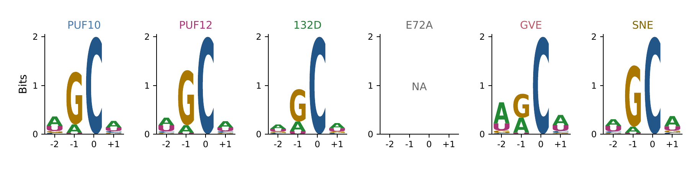

# Module 1 | Mapping target activity and transcriptome-wide RNA editing

## Why this analysis matters

An RNA editor must modify its intended target while limiting editing elsewhere in the transcriptome. Measuring target activity alone cannot reveal that balance. We therefore used RNA sequencing (RNA-seq) to compare target-associated signals and transcriptome-wide candidate editing across six PUF–APOBEC constructs.

Module 1 asks how changes to the PUF and APOBEC components alter these profiles. We combined complementary controls, consistent read-quality criteria and evidence from four biological replicates to define comparable candidate-site sets. These measurements guide construct selection and provide candidate sequences for downstream modelling and experimental validation.

## Experimental design and workflow

We analysed 36 paired-end RNA-seq libraries from human HEK293T cells, comprising nine groups with four biological replicates each. The six editor groups were PUF10, PUF12, 132D, E72A, GVE and SNE. Control/mock, APOBEC-only and PUF-only groups provided complementary background measurements.

GVE and SNE carry PUF mutations, whereas 132D and E72A carry APOBEC mutations. We considered these components separately when interpreting differences between constructs. All libraries were analysed against the human GRCh38 primary assembly and matching GENCODE v50 annotation.


*Figure 1. A shared workflow for comparing RNA editor profiles. Thirty-six libraries underwent adapter trimming, alignment, candidate detection, filtering and replicate-level quantification. Candidate sites and editing profiles inform construct comparisons and planned downstream modelling. The RNA, aligned reads and highlighted nucleotide are schematic illustrations, not measured sequences.*

## Results

### Broader candidate editing did not imply uniformly higher target activity

PUF12 retained 12,908 candidate sites, compared with 2,774 for PUF10 (Fig. 2). Median editing rates across these sites were 13.99% and 12.75%, respectively. PUF12 therefore showed a larger detectable candidate-site set without a comparable increase in its median site rate.


*Figure 2. Candidate editing distributions alongside apparent C388 activity. Coloured points show retained-site rates, each calculated as the median across four biological replicates. Boxplots summarize these distributions, with black horizontal lines marking site medians. Labels above each group give retained-site counts; these are sites, not biological replicates. Orange diamonds mark apparent C388 rates, also summarized across four biological replicates. C388 is excluded from candidate counts, whereas C295 and C871 are not systematically excluded. E72A has no retained candidates, so its distribution and site median are undefined. Endogenous reference T contributes to C388, preventing direct interpretation of this signal as transgene-editing efficiency.*

The target measurements also distinguished PUF10 from PUF12 (Fig. 3). Their apparent C388 rates were 73.23% and 81.01%, respectively, whereas C295 rates were similar at 42.17% and 41.34%. PUF10 showed a higher C871 rate than PUF12, at 75.10% versus 63.50%. Thus, the relative performance of these constructs depended on the monitored position.

### APOBEC variants reduced detectable activity alongside candidate-site counts

The APOBEC variants 132D and E72A showed lower signals at all three monitored positions. We used PUF12 as a descriptive comparator without assuming that each construct differed from it by only one substitution.


*Figure 3. Editing measurements at three monitored positions. Rates are medians across four biological replicates and use matched percentage scales. Each target required depth ≥100 in every treated replicate, without the target-ALT ≥20 gate used for candidate selection. C388 includes endogenous reference T and is therefore reported as an apparent rate. The panel presents descriptive comparisons without replicate-level uncertainty intervals or tests of differences between constructs.*

The 132D group retained 197 candidate sites, with a median site rate of 6.09%. Its apparent C295, C388 and C871 rates were 3.11%, 36.44% and 18.65%, respectively. This reduction extended to both the candidate set and monitored target signals.

E72A retained no candidate sites and showed target rates ranging from 0.05% to 0.32%. Its empty candidate set therefore coincided with very low detectable activity. These results do not establish an active editor with improved specificity.

### PUF variants produced distinct activity and candidate-site profiles

GVE retained 383 candidate sites, approximately 97.0% fewer than PUF12, with a median site rate of 8.66%. Its apparent C388 rate was 64.98%, while C295 and C871 rates were 19.78% and 6.20%. GVE thus combined a smaller candidate set with a measurable apparent C388 signal.

SNE retained 4,389 candidate sites, approximately 66.0% fewer than PUF12, with a median site rate of 11.86%. Its apparent C388 rate was 76.91%, while C295 and C871 rates were 17.83% and 28.28%. Compared with GVE, SNE showed a higher apparent C388 signal alongside a larger candidate set and higher C871 activity.

### Local sequence composition was partly conserved

Guanine was prominent immediately upstream of the central cytosine in every non-empty editor set (Fig. 4). GVE showed less pronounced guanine dominance at position −1 and a more visible adenine component at position −2. These patterns describe the composition of retained sequences and identify a possible context shift for further testing.



*Figure 4. Local sequence composition around retained candidate sites. The logos show positions −2 to +1 around the central cytosine. E72A is NA because no candidates were retained. These descriptive logos do not represent enrichment against a matched sequence background.*

The central cytosine was fixed by site selection and therefore provides no independent evidence of sequence preference. Differences in retained-set size and sequence availability can also influence the logos. A matched-background analysis is needed to distinguish enrichment from the composition of screened transcripts.

### Candidate densities were distributed across callable chromosomes

We compared chromosome profiles using a fixed reference of 899,942 callable cytosines defined from PUF12 and the three control groups. Each editor's candidates were intersected with this reference before chromosome-level normalization. The resulting profiles describe relative candidate density rather than total editing activity.

PUF10, PUF12 and SNE showed broadly distributed profiles, with normalized chromosome shares ranging from approximately 3.1% to 5.7% (Fig. 5). Candidate densities extended across callable autosomes and chromosome X, rather than being restricted to chromosome 19.

The smaller 132D and GVE sets showed more uneven profiles. Their highest shares occurred on chromosome X (7.8%) and chromosome 22 (7.6%), respectively. These peaks comprised only 17 and 14 candidates, leaving sampling variability as a plausible explanation rather than establishing chromosome preference.


*Figure 5. Chromosome profiles within a shared callable-cytosine reference. Candidate counts were divided by chromosome-specific reference-cytosine counts, then scaled to sum to 100% for each non-empty editor set. Here, n denotes reference-intersected candidates. E72A has no candidates, and chromosome Y has no reference cytosines; both are shown as NA. Row-normalized shares cannot rank total candidate burden.*

Reference intersection explains the lower counts in this panel, including 12,903 rather than 12,908 candidates for PUF12. The reference contains callable cytosines rather than PUF12-positive sites, so it does not force a flat PUF12 profile. Nevertheless, interpretation remains conditional on this PUF12-derived reference and should be considered alongside the counts in Figure 2.

## What the results mean for our engineering strategy

The central design lesson is that a smaller candidate-site set must be interpreted together with retained target activity. GVE and SNE support different follow-up priorities. GVE offers a smaller screened candidate set, whereas SNE shows a higher apparent C388 signal. Neither profile establishes universal superiority across targets.

The APOBEC variants highlight the complementary risk of reducing broader editing at the expense of activity. Residual 132D signals justify testing whether useful activity can be retained at selected targets. E72A instead emphasizes the need to preserve activity when modifying the catalytic component. These measurements cannot distinguish altered catalysis from differences in expression or construct stability.

We use the term candidate editing because RNA-seq screening does not independently validate every event. C388 is excluded from candidate counts, but C295 and C871 are not systematically excluded. The retained set therefore should not be treated as a fully validated, exclusively off-target set. SNP-catalogue filtering also cannot remove every sample-specific genetic variant.

Our next experimental cycle will prioritize representative candidates for independent confirmation and separate edited transgene signal from endogenous sequence at C388. Replicate-level effect estimates will also be needed to establish differences between constructs. These experiments are planned extensions of the current computational analysis.

The candidate sequences provide positive evidence for PUF modelling, APOBEC variant assessment and planned LAMAR-based prioritization. Model training labels and independent evaluation require separate design. The accompanying [Design–Build–Test–Learn account](02_Module1_DBTL_EN.md) explains how the computational decisions were developed and tested.

## Methods

### Read preprocessing and alignment

We removed paired-end Illumina adapters with fastp and retained its quality-control reports (Chen et al., 2018). Additional quality, length and poly-G filtering were disabled because read-quality selection was applied during allele counting.

STAR aligned reads to GRCh38 using GENCODE v50, `--twopassMode Basic` and `--sjdbOverhang 149` for 150-nt reads (Dobin et al., 2013). GATK MarkDuplicates and SplitNCigarReads prepared coordinate-sorted alignments for site analysis (McKenna et al., 2010).

### Candidate detection and allele recounting

REDItools2 identified candidate positions with `-S -me 5 -bq 31 -q 31 -men 1` (Flati et al., 2020). Because `-me` measures total non-reference support, we recounted the target alternative allele in every library. Recounting required base quality (BQ) ≥31, mapping quality (MAPQ) ≥31 and a unique-alignment tag of `NH=1`. Uniqueness tags were checked after preprocessing to preserve this read-selection rule.

We excluded duplicate, secondary, supplementary, quality-control-failed and unmapped reads, together with deleted, skipped and non-ACGT observations. Ensembl Variant Effect Predictor (VEP) used an offline GRCh38 cache to identify transcript-compatible candidates (McLaren et al., 2016). Transcript-level C-to-U events were represented as genomic C>T on the positive strand and G>A on the negative strand.

### Genetic variation and sequence-context filters

We excluded exact chromosome–position–REF–ALT matches to four HEK293T SNP catalogues after hg18-to-GRCh38 liftover and reference-allele checks. Each candidate required an unambiguous, transcript-oriented 101-nt sequence centred on cytosine. Low-complexity filtering required entropy ≥1.2, a homopolymer run <20 and a dinucleotide-repeat fraction <0.8.

### Shared coverage and background screening

Editor comparisons were restricted to positions with REF + target ALT depth ≥20 in all 36 libraries. Each control group required a median allele rate ≤0.02, median absolute deviation ≤0.02 and no formal caller detections. The APOBEC-only−Control and PUF-only−Control median differences each had to be ≤0.02. These gates allowed low ALT counts without treating missing evidence as zero editing.

One-sided pooled-read Fisher tests compared each treatment with all three control groups. The largest p-value per site underwent Benjamini–Hochberg correction across the eligible comparison set, requiring a false discovery rate (FDR) ≤0.05 (Benjamini & Hochberg, 1995). This pooled-read statistic supported screening rather than inference across biological replicates.

### Site selection and rate definitions

Retained sites required formal detection in all four treated replicates. Each replicate required target ALT ≥20, depth ≥100 and allele rate ≥0.005. The median absolute deviation of treated rates had to be ≤0.05.

Replicate editing rates were calculated as `target ALT / (REF + target ALT)`. Each site's reported rate was the median across four biological replicates, without background subtraction. The site medians in Figure 2 summarize these reported rates across retained sites.

C295, C388 and C871 were quantified separately, requiring depth ≥100 in all four treated replicates without the ALT20 gate. This preserved low target measurements that would otherwise be excluded by candidate selection. C388 was excluded from candidate-site counts, whereas C295 and C871 were not systematically excluded.

### Chromosome normalization

The shared reference required depth ≥100 in four PUF12 replicates and ≥20 in all twelve controls. Quality, transcript-strand, SNP and sequence criteria also applied, while zero ALT support was allowed. For editor g and chromosome c, N(g,c) denotes reference-intersected candidates and C(c) denotes reference cytosines.

`Normalized share(g,c) = 100 × [N(g,c) / C(c)] / Σk [N(g,k) / C(k)]`

The sum includes only chromosomes with a non-zero reference denominator. This calculation adjusts candidate counts for measurable cytosines and scales each non-empty profile to 100%. The resulting share is neither per-site editing efficiency nor the raw fraction of candidates on a chromosome.

### Representative tool calls


The examples below illustrate tool invocation. Shell variables represent sample files, references and new output paths; `THREADS` specifies allocated CPU threads. They are selected commands, rather than a complete analysis launcher.

**Adapter trimming with fastp.** The two adapter sequences match the paired-end library configuration. Quality selection is deferred to candidate calling and recounting.

```bash
fastp -i "$R1" -I "$R2" -o "$TRIMMED_R1" -O "$TRIMMED_R2" \
  --adapter_sequence AGATCGGAAGAGCACACGTCTGAACTCCAGTCA \
  --adapter_sequence_r2 AGATCGGAAGAGCGTCGTGTAGGGAAAGAGTGT \
  --disable_quality_filtering --disable_length_filtering --disable_trim_poly_g \
  --thread "$THREADS" --json "$QC_JSON" --html "$QC_HTML"
```

**Splice-aware alignment with STAR.** This example uses gzip-compressed reads, a GRCh38 index and matching GENCODE annotation. Two-pass alignment uses detected splice junctions; `sjdbOverhang 149` matches 150-nt reads. Alignment tags and read groups preserve evidence needed downstream.

```bash
STAR --runThreadN "$THREADS" --genomeDir "$STAR_INDEX" \
  --readFilesIn "$TRIMMED_R1" "$TRIMMED_R2" --readFilesCommand zcat \
  --twopassMode Basic --sjdbGTFfile "$GTF" --sjdbOverhang 149 \
  --outSAMtype BAM SortedByCoordinate --outSAMattributes NH HI AS nM MD \
  --outSAMmapqUnique 60 \
  --outSAMattrRGline "ID:$READ_GROUP" "SM:$SAMPLE" "LB:$LIBRARY" PL:ILLUMINA \
  --outFileNamePrefix "$STAR_PREFIX"
```

**Candidate calling with REDItools2.** `PREPARED_BAM` denotes an indexed BAM after duplicate marking, splice processing and uniqueness-tag checks. `REDITOOLS_SCRIPT` is the installed script path, and `FASTA` is the indexed GRCh38 reference.

```bash
python2 "$REDITOOLS_SCRIPT" \
  -f "$PREPARED_BAM" -r "$FASTA" -o "$CALLS_TSV" \
  -S -q 31 -bq 31 -me 5 -men 1
```

Here, `-S` retains positions with mismatches, while `-q` and `-bq` set mapping and base quality thresholds. `-me 5` requires total non-reference support; `-men 1` avoids rejecting a position solely because another mismatch type has fewer than five observations. Target-ALT support and transcript strand are evaluated separately.

## Reproducibility and availability

Workflow settings, environments, counting code and export tools are described in the [REWIRE repository](https://github.com/pdx12320/REWIRE-RNA-editing-pipeline). The accompanying [result summaries](assets/data/displayed_summary.tsv), [chromosome normalization data](assets/data/chromosome_reference_normalized.tsv) and [reference-intersection counts](assets/data/sample_scope_audit.tsv) document the plotted values. Raw sequencing reads and a complete portable analysis launcher are not included in this package.

## References


Benjamini, Y., & Hochberg, Y. (1995). Controlling the false discovery rate: A practical and powerful approach to multiple testing. *Journal of the Royal Statistical Society: Series B (Methodological), 57*(1), 289–300. [https://doi.org/10.1111/j.2517-6161.1995.tb02031.x](https://doi.org/10.1111/j.2517-6161.1995.tb02031.x)

Chen, S., Zhou, Y., Chen, Y., & Gu, J. (2018). fastp: An ultra-fast all-in-one FASTQ preprocessor. *Bioinformatics, 34*(17), i884–i890. [https://doi.org/10.1093/bioinformatics/bty560](https://doi.org/10.1093/bioinformatics/bty560)

Dobin, A., Davis, C. A., Schlesinger, F., Drenkow, J., Zaleski, C., Jha, S., Batut, P., Chaisson, M., & Gingeras, T. R. (2013). STAR: Ultrafast universal RNA-seq aligner. *Bioinformatics, 29*(1), 15–21. [https://doi.org/10.1093/bioinformatics/bts635](https://doi.org/10.1093/bioinformatics/bts635)

Flati, T., Gioiosa, S., Spallanzani, N., Tagliaferri, I., Diroma, M. A., Pesole, G., Chillemi, G., Picardi, E., & Castrignanò, T. (2020). HPC-REDItools: A novel HPC-aware tool for improved large scale RNA-editing analysis. *BMC Bioinformatics, 21*(Suppl. 10), Article 353. [https://doi.org/10.1186/s12859-020-03562-x](https://doi.org/10.1186/s12859-020-03562-x)

McKenna, A., Hanna, M., Banks, E., Sivachenko, A., Cibulskis, K., Kernytsky, A., Garimella, K., Altshuler, D., Gabriel, S., Daly, M., & DePristo, M. A. (2010). The Genome Analysis Toolkit: A MapReduce framework for analyzing next-generation DNA sequencing data. *Genome Research, 20*(9), 1297–1303. [https://doi.org/10.1101/gr.107524.110](https://doi.org/10.1101/gr.107524.110)

McLaren, W., Gil, L., Hunt, S. E., Riat, H. S., Ritchie, G. R. S., Thormann, A., Flicek, P., & Cunningham, F. (2016). The Ensembl Variant Effect Predictor. *Genome Biology, 17*(1), Article 122. [https://doi.org/10.1186/s13059-016-0974-4](https://doi.org/10.1186/s13059-016-0974-4)
