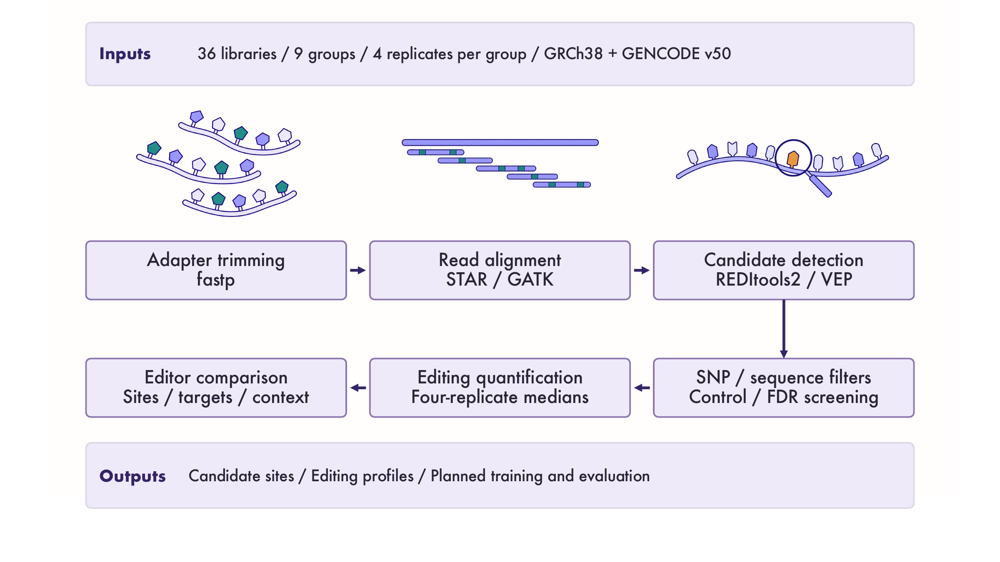
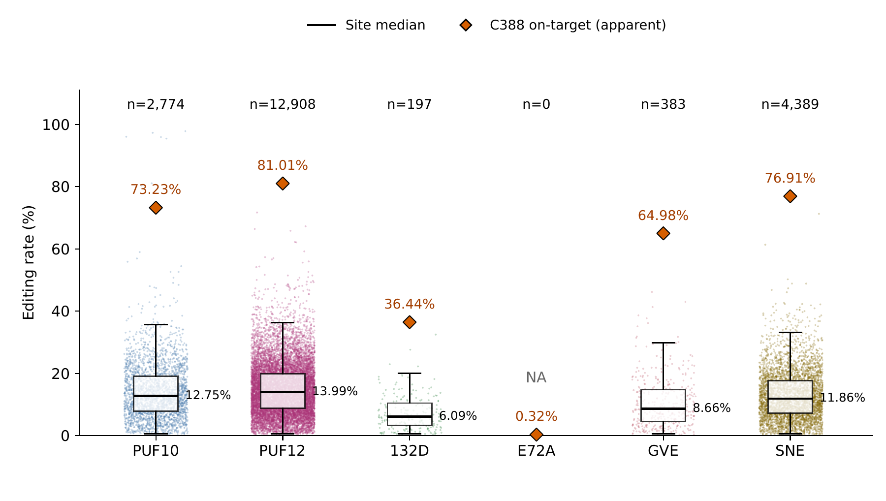
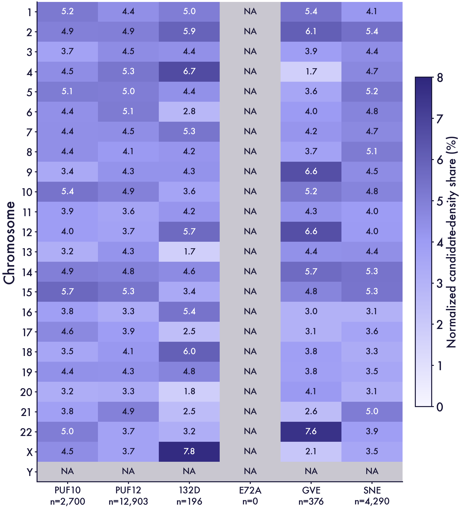
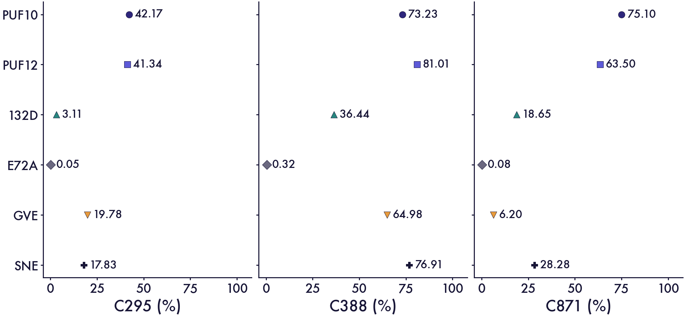

# Module 1 | Engineering a reproducible RNA-seq comparison

## Design–Build–Test–Learn

Comparing RNA editors requires consistent definitions of read evidence, candidate sites and editing rates. Our workflow addresses these requirements through six Design–Build–Test–Learn (DBTL) cycles. Each cycle connects an analysis challenge to its implementation, verification and consequence for the next design decision.

The checks below test computational rules and exported measurements. They do not replace independent biological validation of candidate editing events.

*Figure 1. The computational workflow developed through these engineering cycles. Candidate sites and editing profiles support editor comparisons and planned downstream modelling. Molecular illustrations are schematic and do not depict measured sequences.*

## Cycle 1 | Define consistent read evidence

**Challenge.** Similar parameter names can refer to different quantities across tools. Integer quality scores greater than 30 require cutoffs of at least 31. REDItools2 also distinguishes total non-reference support from support for individual alternative nucleotides.

**Design.** We defined a shared standard of base quality (BQ) ≥31, mapping quality (MAPQ) ≥31 and unique alignment (`NH=1`). Candidate discovery would retain informative positions, while a separate recount would evaluate the intended alternative allele.

**Build.** We specified `-S -me 5 -bq 31 -q 31 -men 1` in REDItools2 and supplied the same quality cutoffs during recounting. The `-me` parameter controls total non-reference observations. Setting `-men` to 5 could reject a position because another mismatch type had fewer than five observations. We therefore used `-men 1` and assessed target-allele support separately.

**Test.** Inspection of the caller's filtering logic confirmed this distinction. A synthetic recount check accepted BQ31/MAPQ31 observations and rejected BQ30, MAPQ30, duplicate reads and missing or non-unique NH tags. This check evaluated counting logic rather than the complete BAM-processing workflow.

**Learn.** Explicit parameter definitions aligned the tools with our biological evidence requirements. Total mismatches could no longer substitute for support for the intended C-to-U event.

## Cycle 2 | Separate target support from control background

**Challenge.** High coverage does not necessarily provide strong support for the target alternative allele. Treatment-associated signals can also occur in controls. Conversely, a large editing-rate cutoff could discard well-supported sites with modest allele fractions.

**Design.** We treated read support, replicate consistency and control background as separate requirements. All six editors were compared within positions meeting a shared coverage requirement across 36 libraries.

**Build.** Each retained site required formal detection in four treated replicates, with target ALT ≥20, depth ≥100 and allele rate ≥0.005 in each. Treated rates required a median absolute deviation ≤0.05. Control/mock, APOBEC-only and PUF-only groups each required low median rates, low variability and no formal detections. Pooled-read Fisher comparisons and Benjamini–Hochberg screening additionally required a false discovery rate (FDR) ≤0.05.

**Test.** Exporter checks accepted the ALT20/depth100 boundary and rejected a site when one replicate had ALT19 or depth99. Missing or duplicated replicate evidence also caused rejection. Background and FDR screening retained 12,908 of 24,398 PUF12 candidates that met the other criteria. None of the 46 E72A candidates meeting those criteria passed the background screen.

**Learn.** Coverage, target-allele support and control background answer different questions. Combining these requirements produced a reproducible screening rule without equating every excluded site with a false positive. The biological optimality of the chosen thresholds remains untested.

*Figure 2. Candidate-site distributions after screening. Each coloured point represents a site's median rate across four biological replicates; black horizontal lines mark medians across retained sites. Counts above the groups denote candidate sites, while orange diamonds show apparent C388 rates. C388 is excluded from candidate counts, but C295 and C871 are not systematically excluded. E72A has no retained candidates and therefore no defined site distribution. Its near-zero target signal is important when interpreting this empty set.*

## Cycle 3 | Reconcile genomic alleles with transcript orientation

**Challenge.** Transcript-level C-to-U editing appears as genomic C>T or G>A, depending on transcript strand. Genomic alleles, transcript orientation and sequencing-read direction are distinct representations. Reversing an already oriented sequence would therefore introduce an error.

**Design.** We preserved genomic coordinates while representing both transcript strands with cytosine-centred sequences. Transcript annotation established substitution compatibility, independently of read direction or gene names alone.

**Build.** After transcript-aware filtering, the strand exporter labelled C>T candidates as `+` and G>A candidates as `−`. It preserved genomic alleles, coordinates, editing rates and already oriented sequences. Every context required 101 unambiguous bases with C at zero-based index 50. REDItools2 `-S` was treated as strict mismatch reporting rather than a strand-correction option.

**Test.** Ten strand-export tests checked both mappings and preservation of original fields. They rejected conflicting strands, unsupported substitutions, duplicate sites and invalid sequence contexts. Reprocessing a correctly annotated table preserved its existing strand and sequence values.

**Learn.** Explicit strand annotation resolved the representation problem without transforming evidence twice. Genomic coordinates remained available for annotation and independent validation of the candidate loci.

## Cycle 4 | Preserve biological replicates in reported rates

**Challenge.** Pooling reads across replicates weights the result towards deeply sequenced samples. It can therefore differ from a summary that gives each biological replicate equal representation. Missing evidence also needs to remain distinguishable from a measured zero.

**Design.** We defined each reported rate as the median of four replicate `ALT/(REF+ALT)` values. All four measurements had to be present and consistent with the exported summary.

**Build.** The exporter retained depth, ALT support and rate for every replicate. It checked the reported site rate against their median and rejected incomplete or duplicated evidence.

**Test.** A synthetic example contained 20 ALT reads per replicate at depths of 100, 200, 400 and 800. The corresponding rates were 20%, 10%, 5% and 2.5%. The exporter accepted their median of 7.5% and rejected the pooled rate of 5.33%. These numbers are software-test examples rather than biological measurements from the experiment.

**Learn.** The aggregation rule forms part of the measurement definition. Retaining replicate-level evidence prevents sequencing depth from silently changing the meaning of the reported rate.

## Cycle 5 | Normalize chromosome profiles to callable sequence

**Challenge.** Chromosomes differ in the number of cytosines that an experiment can measure. Raw candidate counts therefore combine detection opportunity with the distribution of candidate editing.

**Design.** We defined one callable-cytosine reference from PUF12 and the controls. Using this fixed reference gave every editor the same chromosome-level denominator.

**Build.** The reference contained 899,942 cytosines meeting depth, quality, transcript-strand, SNP and sequence criteria; zero ALT support was allowed. We intersected each editor's retained candidates with the reference. Chromosome-specific candidate counts were divided by reference-cytosine counts, and these densities were scaled to sum to 100%.

**Test.** Recalculation of all 144 editor–chromosome records reproduced the normalized values and reference-intersection counts. Every non-empty editor profile summed to 100%. The reference contained no chromosome Y cytosines, giving an undefined value rather than zero. E72A likewise had an undefined profile because its candidate set was empty. Reference intersection accounted for PUF12's 12,903 heatmap candidates, compared with 12,908 total retained candidates.

**Learn.** PUF10, PUF12 and SNE showed broadly distributed relative densities, whereas the smaller 132D and GVE sets were more uneven. Normalization improved comparability within the shared reference but removed information about total candidate burden. We therefore interpreted these profiles together with Figure 2, rather than ranking overall activity from heatmap colours.

*Figure 3. Relative candidate densities within the fixed 899,942-cytosine reference. Each non-empty editor profile sums to 100%, and n denotes reference-intersected candidates. E72A and chromosome Y are NA because the candidate set or reference denominator is empty. These shares describe relative distributions rather than total editing activity.*

## Cycle 6 | Connect candidate profiles to target measurements

**Challenge.** Fewer candidate sites can indicate reduced broader editing, reduced activity or a combination of both. C388 presents an additional ambiguity because endogenous reference T contributes to the measured signal. A strong ALT gate could also hide low target measurements.

**Design.** We interpreted candidate-site profiles alongside C295, C388 and C871 measurements. PUF variants GVE and SNE were considered separately from APOBEC variants 132D and E72A.

**Build.** Target measurements required depth ≥100 in all four replicates without imposing ALT20. We labelled C388 as apparent and excluded it from candidate-site counts. C295 and C871 were not systematically excluded, so the candidate set is not exclusively off-target.

**Test.** E72A showed rates of 0.05–0.32% across the monitored positions alongside an empty candidate set. GVE retained fewer candidates and showed lower C295/C871 signals than SNE. SNE instead showed a higher apparent C388 signal together with a larger candidate set.

**Learn.** GVE and SNE motivate different follow-up priorities rather than a universal ranking. GVE prioritizes a smaller screened set, whereas SNE prioritizes its higher apparent C388 signal. The APOBEC variants emphasize the need to retain useful activity while reducing broader editing. Expression, coverage and screening effects remain possible contributors to the observed construct differences.

*Figure 4. Target measurements used to interpret candidate-site profiles. Rates are medians across four biological replicates, with depth ≥100 required in each replicate and no ALT20 gate. C388 includes endogenous reference T, so its apparent rate does not isolate transgene editing. The comparisons are descriptive and do not establish statistically supported differences between constructs.*

## The next experimental iteration

These cycles established explicit rules for candidate detection, rate aggregation and editor comparison. The next iteration will test representative candidate sites independently and distinguish edited transgene from endogenous sequence at C388. Replicate-level measurements will then assess whether the observed profiles translate into improved editor performance.

This experimental feedback remains planned rather than demonstrated by the current analysis. The [Module 1 results and methods](01_Module1_Wiki_EN.md) present the biological comparisons and complete screening criteria. The [screening summary](assets/data/six_group_summary.tsv), [chromosome normalization data](assets/data/chromosome_reference_normalized.tsv) and [reference-intersection counts](assets/data/sample_scope_audit.tsv) provide supporting records.
