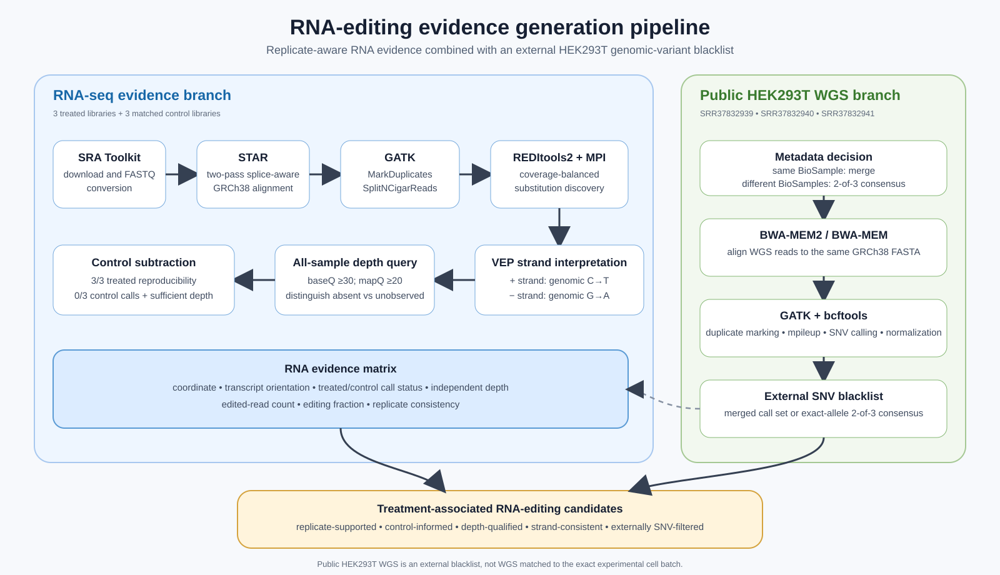

# Model 1 Methods — RNA-editing evidence generation

## Overview

We developed a transcriptome-wide evidence pipeline to distinguish reproducible REWIRE-associated C-to-U signals from sequencing noise, control background and plausible genomic variation. Three editor-treated RNA-seq libraries were analyzed together with three matched control libraries. RNA-derived substitutions were discovered with REDItools2, interpreted using transcript strand, reassessed at the same genomic coordinates in every replicate, and compared against a public HEK293T whole-genome variant blacklist.



**Figure 1. RNA-editing evidence generation pipeline.** The RNA-seq branch identifies quality-supported substitutions and evaluates replicate consistency, control support and transcript orientation. The WGS branch aligns three public HEK293T WGS runs, calls genomic SNVs and constructs either a merged call set or an exact-allele 2-of-3 consensus blacklist. The two branches converge in an auditable site-level evidence matrix. Public WGS is used as an external blacklist rather than as matched WGS from the experimental cell batch.

## RNA-seq alignment with STAR

Paired-end RNA-seq reads were downloaded from the Sequence Read Archive and aligned to the GRCh38 primary assembly using STAR in two-pass mode. The first pass discovers splice junctions, while the second pass realigns reads using the detected junction set. Coordinate-sorted BAM files were produced, and read-group fields were added to preserve sample, library and platform identity for downstream GATK processing.

```bash
STAR \
  --genomeDir "$STAR_INDEX" \
  --runThreadN 50 \
  --readFilesIn sample_1.fastq.gz sample_2.fastq.gz \
  --readFilesCommand gunzip -c \
  --twopassMode Basic \
  --outSAMtype BAM SortedByCoordinate \
  --outSAMattrRGline ID:sample SM:sample LB:sample PL:ILLUMINA PU:sample
```

The aligned BAM files were checked for read-group presence and readability before further processing.

## RNA-aware BAM preprocessing

GATK MarkDuplicates was used to flag PCR and optical duplicates and to generate duplication metrics. Duplicates remained represented in the BAM through SAM flags rather than being silently deleted. GATK SplitNCigarReads was then used to split reads spanning splice junctions into exon-aligned segments suitable for position-level mismatch analysis.

```bash
gatk MarkDuplicates \
  -I sample.Aligned.sortedByCoord.out.bam \
  -O sample.markduplicates.bam \
  -M sample.markduplicates.metrics.txt \
  --CREATE_INDEX true

gatk SplitNCigarReads \
  -R GRCh38.primary_assembly.genome.fa \
  -I sample.markduplicates.bam \
  -O sample.splitncigarreads.bam
```

## Coverage-aware REDItools2 analysis

A per-position coverage map was generated with samtools depth for each reference contig. The coverage map is a workload-balancing input used by parallel REDItools2; it is not itself an editing call set. Coverage generation was limited to eight concurrent processes to reduce storage contention, while REDItools2 used 30 MPI processes for interval analysis.

```bash
mpirun -np 30 python2 parallel_reditools.py \
  -f sample.splitncigarreads.bam \
  -r GRCh38.primary_assembly.genome.fa \
  -G sample.splitncigarreads.cov \
  -D sample_coverage_directory/ \
  -t sample_temp_directory/ \
  -Z GRCh38.primary_assembly.genome.fa.fai \
  -S \
  -me 20
```

`-S` restricts output to positions containing observed substitutions. `-me 20` requires at least 20 edited reads at a reported position and is not a total-depth threshold. REDItools2 records genomic coordinate, reference base, quality-filtered coverage, A/C/G/T counts, substitution class and estimated editing frequency.

GRCh38 supplementary contig suffixes such as `.1` and `.2` were preserved during temporary-file parsing. The corrected parser removes only the final `.gz` extension:

```python
pieces = os.path.basename(little_file)[:-3].rsplit("#", 2)
```

## Transcript-oriented C-to-U interpretation

REDItools2 reports substitutions in genomic coordinates, whereas C-to-U editing occurs in RNA transcripts. All substitutions were converted into a union VCF and annotated with VEP. Genomic C-to-T substitutions were interpreted as candidate C-to-U events on positive-strand transcripts, while genomic G-to-A substitutions were interpreted as the reverse-complement representation of C-to-U editing on negative-strand transcripts. Coordinates assigned to transcripts on both orientations were treated as ambiguous rather than forced into one class.

```text
positive-strand transcript: genomic C→T
negative-strand transcript: genomic G→A
```

## Control subtraction and replicate evidence

A position absent from a REDItools2 control table was not automatically considered unedited, because low control coverage can also produce a missing call. Therefore, all union candidate coordinates were queried independently in every treated and control BAM using minimum base quality 30 and mapping quality 20.

The default conservative rule retained positions that were:

```text
called in all three treated replicates
called in no control replicate
covered by at least 20 reads in all six samples
consistent with transcript-level C-to-U editing
not present in the selected WGS genomic-variant blacklist
```

For each sample, the evidence matrix preserves call status, independent candidate-site depth, REDItools2 coverage, alternate-read count and editing rate. This allows alternative thresholds to be tested without repeating alignment or REDItools2 discovery.

## Public HEK293T WGS processing

Three public WGS runs were configured:

```text
SRR37832939
SRR37832940
SRR37832941
```

The run metadata are checked before analysis. If all runs share one BioSample accession, the aligned BAMs are merged and variants are called once. If the runs represent different BioSamples, each run is called separately and an exact-allele blacklist is constructed by retaining variants supported by at least two of the three WGS call sets.

```bash
nohup bash scripts/wgs/run_3run_wgs_pipeline.sh \
  --runs config/wgs_runs.tsv \
  --reference "$REF" \
  --outdir "$WGS_OUT" \
  --mode auto \
  --threads 32 \
  --min-dp 10 \
  --min-alt 3 \
  --min-vaf 0.05 \
  --min-qual 20 \
  > "$WGS_OUT.pipeline.log" 2>&1 &
```

The WGS branch uses SRA Toolkit for download and conversion, BWA-MEM2 or BWA-MEM for GRCh38 alignment, GATK MarkDuplicates for duplicate marking, and bcftools mpileup/call for SNV discovery. Variants are normalized against the same GRCh38 FASTA used in the RNA-seq branch. Single-run variants must have depth at least 10, at least three alternate reads, alternate-allele fraction at least 0.05 and QUAL at least 20.

The resulting VCF is supplied to the final evidence filter through `--wgs-vcf`. Filtering is performed using the exact `CHROM:POS:REF:ALT` allele, preventing unrelated alternate alleles at the same coordinate from being removed.

## Interpretation

The WGS runs are external public HEK293T data and are not derived from the exact CU5.17 experimental cell batch. Therefore, the WGS resource is used as a genomic-variant blacklist rather than described as matched WGS. The final output represents treatment-associated RNA-editing candidates supported by replicate, control, depth, strand and public genomic-variant evidence. High-priority sites still require orthogonal experimental validation.
