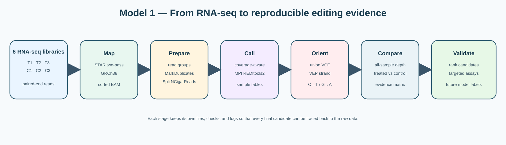
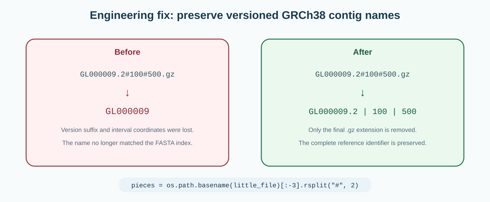
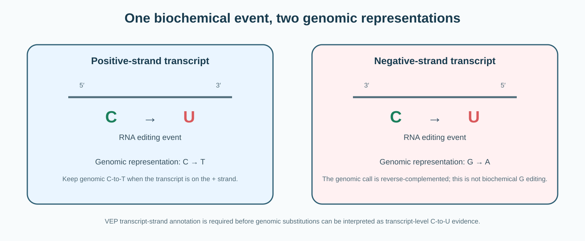
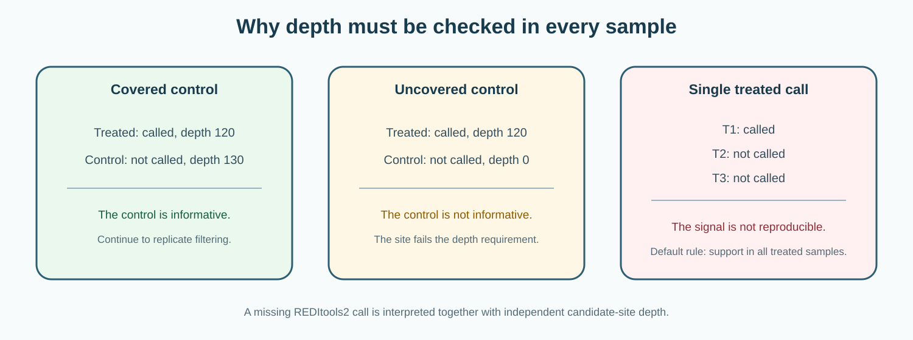
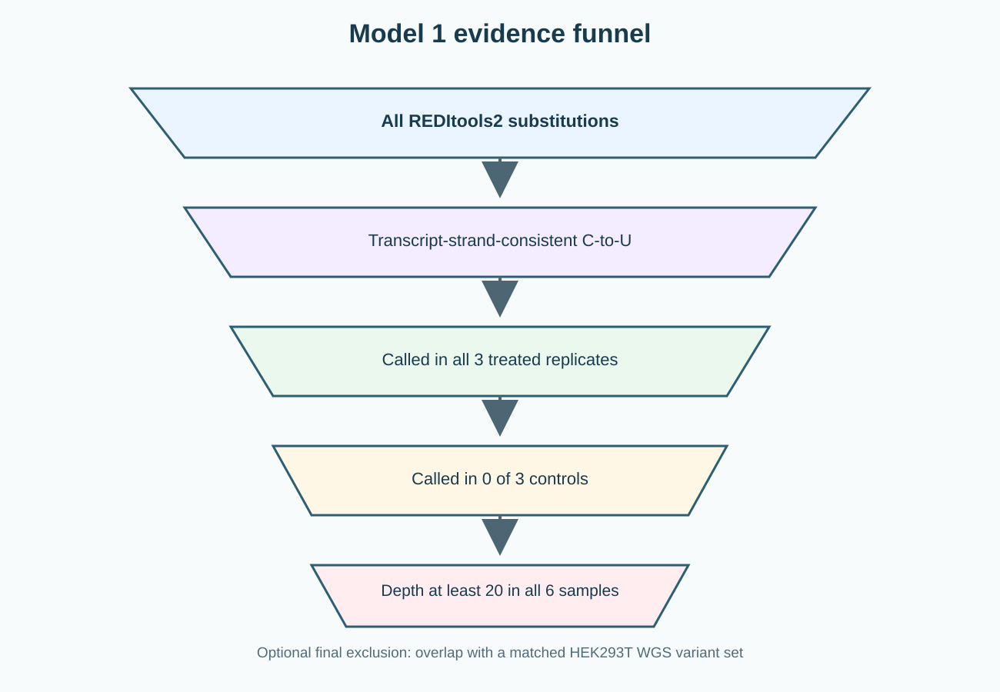
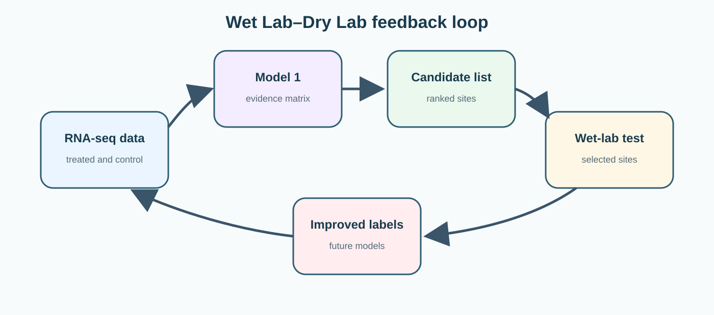
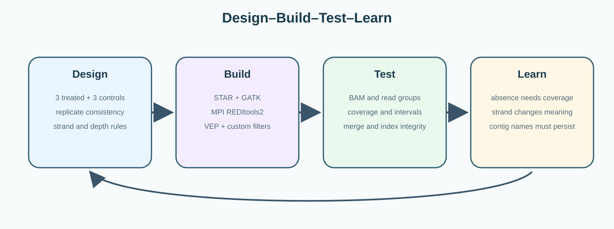

# Model 1 — RNA-editing Evidence Pipeline

## From six RNA-seq libraries to reproducible evidence for REWIRE activity

Our REWIRE system recruits a cytidine deaminase to a selected RNA sequence. Editing at the designed reporter shows that the construct can work at the intended target, but it does not answer a second question:

> **Does REWIRE also produce reproducible C-to-U signals elsewhere in the transcriptome?**

We built Model 1 to answer this question from experimental RNA-seq data. Instead of labeling every mismatch as an off-target, the pipeline creates a traceable evidence chain. A candidate must be supported by quality-filtered reads, interpreted in the correct transcript orientation, reproduced across treated samples, evaluated at the same coordinate in controls, and separated from possible genomic variation when matched WGS data are available.

The full code, parameters, installation notes, and troubleshooting record are available in the [GitHub README](https://github.com/pdx12320/REWIRE-RNA-editing-pipeline#readme).

---

## Our design

We compared three editor-treated RNA-seq libraries with three matched control libraries.

| Condition | Replicate | Sample | SRA accession |
|---|---:|---|---|
| Treated | 1 | CU517_GC_T1 | SRR27885768 |
| Treated | 2 | CU517_GC_T2 | SRR27885766 |
| Treated | 3 | CU517_GC_T3 | SRR27885765 |
| Control | 1 | CU517_GC_C1 | SRR27885767 |
| Control | 2 | CU517_GC_C2 | SRR27885764 |
| Control | 3 | CU517_GC_C3 | SRR27885763 |

Replicates test whether a signal is reproducible rather than library-specific. Controls provide background context, but only when the same coordinate has enough sequencing depth to be informative.

---

## Workflow overview



The workflow separates **discovery** from **interpretation**. REDItools2 first reports quality-supported substitutions. Transcript strand, all-sample depth, treated/control status, and optional genomic variation are then added before a site is considered a Model 1 candidate.

---

# Stage 1 — Organize and download the data

The sample name, condition, replicate number, and SRA accession are stored in one manifest:

```text
config/samples.tsv
```

```tsv
sample	group	replicate	srr
CU517_GC_T1	treated	1	SRR27885768
CU517_GC_T2	treated	2	SRR27885766
CU517_GC_T3	treated	3	SRR27885765
CU517_GC_C1	control	1	SRR27885767
CU517_GC_C2	control	2	SRR27885764
CU517_GC_C3	control	3	SRR27885763
```

This prevents treated/control labels from being re-entered manually at different stages.

```bash
python3 scripts/download_sra_fastq.py \
  --project "$PROJECT" \
  --manifest config/samples.tsv \
  --threads 16
```

**Checkpoint:** every sample must produce one non-empty read-1 FASTQ and one non-empty read-2 FASTQ.

---

# Stage 2 — Map reads to GRCh38

Paired-end reads are aligned to the GRCh38 primary assembly with STAR in two-pass mode.

```bash
python3 scripts/run_star_alignment.py \
  --project "$PROJECT" \
  --star-index "$STAR_INDEX" \
  --manifest config/samples.tsv \
  --threads 50
```

The alignment writes coordinate-sorted BAM files and sample-level read-group information.

```bash
STAR \
  --genomeDir "$STAR_INDEX" \
  --runThreadN 50 \
  --readFilesIn sample_1.fastq.gz sample_2.fastq.gz \
  --readFilesCommand gunzip -c \
  --twopassMode Basic \
  --outSAMtype BAM SortedByCoordinate \
  --outSAMattrRGline ID:sample SM:sample PL:ILLUMINA LB:sample PU:sample
```

### Why read groups became a checkpoint

During development, missing read-group metadata caused GATK to fail. We therefore validate the BAM header instead of treating read groups as an invisible software detail.

```bash
samtools view -H sample.Aligned.sortedByCoord.out.bam | grep '^@RG'
```

**Checkpoint:** the BAM must be readable, indexed, and assigned to the correct sample.

---

# Stage 3 — Prepare RNA alignments

RNA-seq reads often span exon junctions. Before site calling, each BAM is processed with GATK.

```bash
python3 scripts/run_gatk_preprocessing.py \
  --project "$PROJECT" \
  --reference "$REF" \
  --manifest config/samples.tsv \
  --java-options=-Xmx16g
```

The stage performs three operations:

1. repair read groups when they are missing;
2. mark PCR duplicates and record duplicate metrics;
3. run `SplitNCigarReads` on spliced RNA alignments.

```bash
gatk SplitNCigarReads \
  -R GRCh38.primary_assembly.genome.fa \
  -I markduplicates.bam \
  -O splitncigarreads.bam
```

Duplicates are marked rather than silently removed. Their status remains visible in the BAM flags and metrics.

**Checkpoint:** every final BAM is tested with `samtools quickcheck` before entering REDItools2.

---

# Stage 4 — Build a coverage map for parallel analysis

Parallel REDItools2 uses a per-position coverage map to divide the genome into intervals with more balanced workloads. This coverage file is a scheduling input, not the final editing result.

```bash
bash scripts/generate_reditools_coverage_limited.sh \
  sample.splitncigarreads.bam \
  sample_coverage_directory \
  GRCh38.primary_assembly.genome.fa.fai \
  8
```

The helper calculates coverage separately for each reference contig:

```bash
samtools depth -r chromosome sample.splitncigarreads.bam \
  > sample_coverage_directory/chromosome
```

The original helper can launch one disk-intensive process for every reference contig. We therefore separated two forms of parallelism:

```text
coverage generation: 8 concurrent depth jobs
REDItools2 analysis: 30 MPI processes
```

This reduces avoidable storage contention without removing MPI parallelism from the main analysis.

---

# Stage 5 — Call candidate substitutions

Each sample is analyzed independently, while genomic intervals within the sample are distributed across MPI workers.

```bash
nohup bash scripts/run_reditools_all_samples.sh \
  "$PROJECT" \
  "$REF" \
  "$REDITOOLS" \
  "$CONDA_PREFIX/bin/python" \
  30 8 8 \
  > "$PROJECT/logs/reditools.log" 2>&1 &
```

The main REDItools2 command is:

```bash
mpirun -np 30 python2 parallel_reditools.py \
  -f sample.splitncigarreads.bam \
  -r GRCh38.primary_assembly.genome.fa \
  -G sample.splitncigarreads.cov \
  -D sample_coverage_directory/ \
  -t sample_temp_directory/ \
  -Z GRCh38.primary_assembly.genome.fa.fai \
  -S \
  -me 20
```

| Parameter | Role in Model 1 |
|---|---|
| `-S` | strict mode: only positions with an observed edit are written |
| `-me 20` | require at least 20 editing events at a reported position |
| default `-q 20` | discard reads below mapping quality 20 |
| default `-bq 30` | discard bases below base quality 30 |
| `-np 30` | distribute intervals across 30 MPI processes |
| `-G`, `-D` | provide complete and per-contig coverage data |

The edited-read threshold is deliberately stringent. It prioritizes strongly supported positions but can miss low-frequency activity.

For every reported position, REDItools2 stores the coordinate, reference base, quality-filtered coverage, A/C/G/T read counts, observed substitution, and estimated frequency.

---

# Engineering contribution — Preserving GRCh38 contig names

GRCh38 contains supplementary contigs with versioned identifiers such as `GL000194.1`, `GL000205.2`, and `KI270750.1`. The `.1` and `.2` suffixes are part of the actual reference names.

During the first complete run, REDItools2 finished interval computation but failed while sorting the temporary files:

```text
ValueError: 'chrGL000009' is not in list
```



The original parser removed everything after the first dot. We replaced it with:

```python
pieces = os.path.basename(little_file)[:-3].rsplit("#", 2)
```

The new parser removes only the final `.gz` extension and preserves the complete contig identifier and interval coordinates.

### What we learned

A pipeline can finish hours of biological computation and still fail during output integration. Exact reference names and merge logic therefore became explicit quality-control targets in Model 1.

---

# Stage 6 — Interpret substitutions in transcript orientation

RNA editing occurs in transcripts, while the BAM and REDItools2 tables use genomic coordinates.



The rule is:

```text
positive-strand transcript: transcript C-to-U appears as genomic C-to-T
negative-strand transcript: transcript C-to-U appears as genomic G-to-A
```

The negative-strand G-to-A representation does not mean that REWIRE biochemically edits G. It is the reverse-complement representation of transcript-level C-to-U editing.

We first combine substitutions from all six samples into one union VCF and one candidate BED:

```bash
python3 scripts/reditools_union_to_vcf.py \
  --manifest config/samples.tsv \
  --reditools-dir "$PROJECT/reditools/tables" \
  --vcf "$PROJECT/vcf/CU5.17_EGFP_GC.REDItools_union.vcf" \
  --bed "$PROJECT/vcf/CU5.17_EGFP_GC.REDItools_union.bed"
```

VEP then supplies transcript orientation:

```bash
python3 scripts/run_vep_annotation.py \
  --project "$PROJECT" \
  --cache "$VEP_CACHE"
```

Coordinates with conflicting positive- and negative-strand transcript annotations are treated as ambiguous instead of being assigned arbitrarily.

---

# Stage 7 — Ask whether every sample was informative

A site absent from a control call table is not automatically a negative observation. The position may simply have insufficient coverage.

```bash
bash scripts/build_candidate_depth_tables.sh \
  "$PROJECT" \
  "$PROJECT/vcf/CU5.17_EGFP_GC.REDItools_union.bed" \
  config/samples.tsv
```

The independent depth query uses:

```text
minimum base quality = 30
minimum mapping quality = 20
```



This distinction prevents “not called” from being confused with “not sequenced.”

---

# Stage 8 — Build the six-sample evidence matrix

The final comparison integrates:

- REDItools2 call status;
- transcript orientation;
- independent candidate-site depth;
- treated/control assignment;
- optional matched WGS overlap.

```bash
python3 scripts/filter_c_to_u_and_compare.py \
  --manifest config/samples.tsv \
  --reditools-dir "$PROJECT/reditools/tables" \
  --vep "$PROJECT/vep/CU5.17_EGFP_GC.vep.tsv" \
  --depth-dir "$PROJECT/candidate_depth" \
  --output-dir "$PROJECT/final" \
  --min-treated-reps 3 \
  --max-control-called-reps 0 \
  --min-depth-all-reps 20
```



The conservative default rule requires:

```text
called in all three treated replicates
AND called in no control replicate
AND candidate-site depth at least 20 in all six samples
AND consistent with transcript-level C-to-U editing
AND absent from the optional matched WGS variant set
```

The matrix keeps more than a final yes/no label. For each sample, it stores call status, independent depth, REDItools2 depth, edited-read count, and editing frequency. Alternative thresholds can therefore be tested without rerunning alignment and REDItools2.

---

# How Model 1 supports the wet lab

Model 1 does not replace experimental validation. It reduces the search space and records why each site was prioritized.



### Prioritizing validation targets

Candidates with reproducible treated support and informative control coverage can be ranked for targeted amplicon sequencing, independent RNA-seq, or another site-specific assay.

### Evaluating specificity

The intended reporter site and endogenous candidates can be described using the same evidence types: depth, edited-read support, frequency, replicate consistency, and control status.

### Creating labels for downstream models

Supported positives and well-covered background positions can become examples for later sequence models. Model 1 provides the evidence layer; the later model learns from that evidence.

---

# Design–Build–Test–Learn



### Design

We designed a six-sample workflow based on treated reproducibility, matched controls, transcript orientation, and independent all-sample depth.

### Build

We combined SRA Toolkit, STAR, GATK, samtools, MPI REDItools2, VEP, and custom Python filters into a modular workflow.

### Test

We tested BAM readability, read-group presence, coverage generation, interval completion, compressed output integrity, reference ordering, and tabix indexing.

### Learn

Three lessons changed the final design:

1. absence of a call is not evidence without sufficient depth;
2. transcript orientation changes the genomic representation of C-to-U editing;
3. exact contig identifiers must survive every temporary filename and merge operation.

---

# Limitations

Model 1 produces computational RNA-editing candidates, not automatically confirmed off-targets.

RNA-seq mismatches may also arise from:

- genomic variants;
- alignment ambiguity;
- sequencing artifacts;
- endogenous RNA modification;
- repetitive or low-complexity regions;
- sample- or batch-specific effects.

Matched HEK293T WGS filtering is important for stronger conclusions. Without matched WGS, retained positions should be described as **RNA-derived candidate editing sites**.

The strict edited-read threshold may miss low-frequency activity. A later sensitivity analysis can test lower thresholds together with stronger artifact controls.

High-priority sites still require orthogonal validation.

---

# Our contribution

Model 1 provides:

- a fixed six-sample treated/control manifest;
- a reproducible RNA-seq-to-evidence workflow;
- limited-concurrency coverage generation for shared storage;
- a fix for versioned REDItools2 contig parsing;
- transcript-oriented C-to-U interpretation;
- independent depth confirmation in every sample;
- an auditable treated/control evidence matrix;
- reusable code and figures for future REWIRE datasets.

No numerical result files are included yet. Final counts, result tables, and result-specific figures will be added only after all six samples complete the same workflow and pass the same integrity checks.

For complete implementation details, see the [REWIRE RNA-editing pipeline repository](https://github.com/pdx12320/REWIRE-RNA-editing-pipeline#readme).
