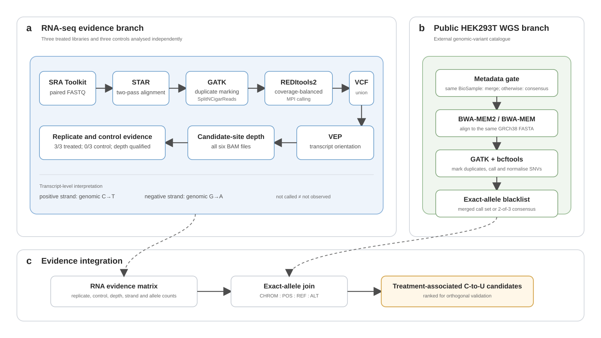

# Model 1 — RNA-editing evidence pipeline

## Question

REWIRE recruits a cytidine deaminase to a selected RNA target. Reporter editing demonstrates on-target activity, but does not establish transcriptome-wide specificity. Model 1 therefore asks:

> **Which C-to-U signals are reproducible after treatment, adequately measured in controls, consistent with transcript orientation and not readily explained by genomic variation?**

Rather than labelling every RNA-seq mismatch as an off-target, the pipeline records replicate support, control depth, transcript orientation, edited-read counts and overlap with a public HEK293T genomic-variant catalogue.

## Input data

We analysed three treated RNA-seq libraries and three controls deposited in the Sequence Read Archive.<sup>1</sup>

| Condition | Replicate | Sample | SRA accession |
|---|---:|---|---|
| Treated | 1 | CU517_GC_T1 | SRR27885768 |
| Treated | 2 | CU517_GC_T2 | SRR27885766 |
| Treated | 3 | CU517_GC_T3 | SRR27885765 |
| Control | 1 | CU517_GC_C1 | SRR27885767 |
| Control | 2 | CU517_GC_C2 | SRR27885764 |
| Control | 3 | CU517_GC_C3 | SRR27885763 |

The WGS branch is configured with `SRR37832939`, `SRR37832940` and `SRR37832941`. Before analysis, the pipeline verifies the organism, library strategy, paired-end layout and BioSample accession. Runs are merged only when they belong to the same BioSample; otherwise, exact alleles supported by at least two runs form the conservative blacklist.

## Assumptions

1. **A mismatch is not automatically an editing event.** It may arise from sequencing error, alignment ambiguity, endogenous editing or genomic variation.
2. **A missing control call is not automatically negative evidence.** The coordinate must have sufficient control coverage.
3. **C-to-U editing must be interpreted in transcript orientation.** It appears as genomic C→T on positive-strand transcripts and genomic G→A on negative-strand transcripts.
4. **Public WGS is a blacklist, not matched evidence.** HEK293-derived sublines show measurable genomic divergence.<sup>2</sup>

## Workflow



**Figure 1 | RNA-editing evidence generation pipeline.** **a,** The RNA-seq branch identifies quality-supported substitutions and adds transcript orientation, all-sample depth and treated/control evidence. **b,** The WGS branch constructs an external genomic-SNV blacklist. **c,** The branches are joined by exact `CHROM:POS:REF:ALT` matching to produce candidates for orthogonal validation.

# Method

## 1. RNA-seq alignment

Paired-end reads are aligned to the GRCh38 primary assembly with STAR in two-pass mode.<sup>3</sup> The resulting coordinate-sorted BAM files include read groups that preserve sample, library and platform identity. Read groups do not normalise sequencing depth.

## 2. RNA-aware preprocessing

GATK `MarkDuplicates` flags PCR and optical duplicates and records duplication metrics. `SplitNCigarReads` then processes reads spanning splice junctions into exon-aligned segments suitable for position-level mismatch analysis.<sup>4</sup>

Each final BAM must be sorted, indexed and readable before substitution calling.

## 3. Substitution calling

REDItools2, the parallel implementation of REDItools, scans each library independently.<sup>5</sup> A coverage map divides the reference into intervals with similar computational load; it is a scheduling input, not an editing result.

| Setting | Interpretation |
|---|---|
| `-S` | report positions containing a substitution |
| `-me 20` | require at least 20 edited reads at a reported position |
| mapping quality | discard reads below 20 |
| base quality | discard bases below 30 |
| MPI processes | distribute intervals across 30 workers |

The edited-read threshold favours strongly supported events and may miss low-frequency editing.

### GRCh38 contig-name fix

Version suffixes in identifiers such as `GL000194.1` and `KI270750.1` are part of the reference name. The temporary-file parser removes only the terminal `.gz` extension:

```python
pieces = os.path.basename(little_file)[:-3].rsplit("#", 2)
```

This preserves supplementary-contig names during sorting and merging.

## 4. Transcript orientation

Candidate substitutions are combined into one union VCF and annotated with the Ensembl Variant Effect Predictor.<sup>6</sup>

```text
positive-strand transcript: genomic C→T
negative-strand transcript: genomic G→A
```

A negative-strand G→A call is the reverse-complement representation of transcript-level C-to-U editing. Sites assigned to transcripts on both orientations are marked as ambiguous.

## 5. Control subtraction

Every union candidate is queried directly in all six BAM files using base quality ≥30 and mapping quality ≥20. This distinguishes **not called despite sufficient depth** from **not observed because the sample was uninformative**.

## 6. Public WGS filtering

Public WGS reads are aligned to the same GRCh38 FASTA using BWA-MEM2 or BWA-MEM,<sup>7</sup> followed by duplicate marking and SNV calling with bcftools.<sup>8</sup> Variants are normalised against the same reference used for RNA-seq.

A single-run SNV is retained when depth is ≥10, alternate-read count is ≥3, alternate-allele fraction is ≥0.05 and QUAL is ≥20.

## 7. Evidence integration

The conservative default definition requires:

```text
called in all three treated replicates
AND called in no control replicate
AND candidate-site depth ≥20 in all six RNA-seq libraries
AND transcript orientation consistent with C-to-U editing
AND the exact allele absent from the selected WGS blacklist
```

The final site matrix retains call status, independent depth, REDItools2 depth, alternate-read count, editing fraction and WGS overlap for every sample.

## Validation

The workflow checks FASTQ integrity, read groups, BAM sorting and indexing, duplicate metrics, completeness of REDItools2 interval files, versioned contig names, bgzip/tabix integrity, candidate depth in all six samples and exact-allele WGS overlap.

These checks make technical failure modes visible; they do not by themselves prove biological editing.

## Results

The final page will report per-sample calls, strand-consistent candidates, treated-replicate overlap, control support, WGS-blacklisted sites and the final ranked candidate set after all samples pass the same quality-control procedure.

## Wet-lab integration

Model 1 prioritises sites for targeted amplicon sequencing, independent RNA-seq or another orthogonal assay. The evidence matrix can also provide carefully defined positive and background examples for downstream sequence models.

## Limitations

RNA-seq mismatches may arise from genomic variants, alignment ambiguity, sequencing artefacts, endogenous RNA modification, repetitive sequence or batch effects. Replicate consistency, control depth, transcript orientation and public WGS filtering reduce these alternatives but do not eliminate them.

Because the WGS data are public and were not generated from the exact CU5.17 experimental cell batch, retained sites should be described as:

> **treatment-associated RNA-editing candidates filtered against an external HEK293T genomic-variant catalogue**

They should not be described as definitively SNV-free off-targets.

## Contribution

Model 1 provides a fixed three-treated/three-control evidence design, coverage-balanced REDItools2 calling, recovery of versioned GRCh38 contigs, transcript-oriented interpretation, independent control-depth assessment and an exact-allele public WGS blacklist.

## References

1. Leinonen, R., Sugawara, H. & Shumway, M. The Sequence Read Archive. *Nucleic Acids Res.* **39**, D19–D21 (2011). doi:10.1093/nar/gkq1019
2. Lin, Y.-C. *et al.* Genome dynamics of the human embryonic kidney 293 lineage in response to cell biology manipulations. *Nat. Commun.* **5**, 4767 (2014). doi:10.1038/ncomms5767
3. Dobin, A. *et al.* STAR: ultrafast universal RNA-seq aligner. *Bioinformatics* **29**, 15–21 (2013). doi:10.1093/bioinformatics/bts635
4. McKenna, A. *et al.* The Genome Analysis Toolkit: a MapReduce framework for analyzing next-generation DNA sequencing data. *Genome Res.* **20**, 1297–1303 (2010). doi:10.1101/gr.107524.110
5. Picardi, E. & Pesole, G. REDItools: high-throughput RNA editing detection made easy. *Bioinformatics* **29**, 1813–1814 (2013). doi:10.1093/bioinformatics/btt287
6. McLaren, W. *et al.* The Ensembl Variant Effect Predictor. *Genome Biol.* **17**, 122 (2016). doi:10.1186/s13059-016-0974-4
7. Li, H. & Durbin, R. Fast and accurate short read alignment with Burrows–Wheeler transform. *Bioinformatics* **25**, 1754–1760 (2009). doi:10.1093/bioinformatics/btp324
8. Danecek, P. *et al.* Twelve years of SAMtools and BCFtools. *GigaScience* **10**, giab008 (2021). doi:10.1093/gigascience/giab008

**Code and reproducibility:** https://github.com/pdx12320/REWIRE-RNA-editing-pipeline
