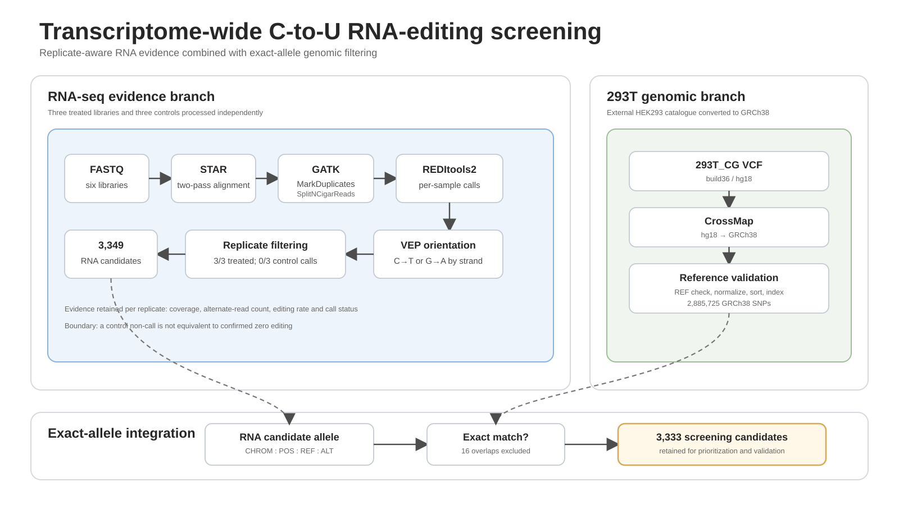

# Dry Lab — Transcriptome-wide C-to-U RNA-editing screening

## Overview

ORCA is our programmable PUF–APOBEC RNA-editing system. To evaluate its transcriptome-wide specificity, we developed a dry-lab workflow that combines three treated and three control RNA-seq libraries with an assembly-harmonized 293T genomic-variant catalogue.

The workflow identifies signals that are reproducible after treatment, not called in controls under the same settings, consistent with transcript strand, and not readily explained by known 293T genomic variation. It also provides the evidence and continuous labels used by the downstream LAMAR editing-efficiency model.

## Input data

| Condition | Replicate | Sample | SRA accession |
|---|---:|---|---|
| Treated | 1 | CU517_GC_T1 | SRR27885768 |
| Treated | 2 | CU517_GC_T2 | SRR27885766 |
| Treated | 3 | CU517_GC_T3 | SRR27885765 |
| Control | 1 | CU517_GC_C1 | SRR27885767 |
| Control | 2 | CU517_GC_C2 | SRR27885764 |
| Control | 3 | CU517_GC_C3 | SRR27885763 |

Each library was processed independently so that replicate support remained visible throughout the analysis.

## Workflow



**Figure 1 | Transcriptome-wide RNA-editing screening workflow.** The RNA-seq branch generates replicate-aware, transcript-oriented C-to-U evidence. In parallel, the external `293T_CG` catalogue is converted from hg18 to GRCh38 and reference-validated. Exact-allele comparison then removes plausible genomic variants while preserving all exclusions for audit.

```text
RNA-seq alignment and preprocessing
→ REDItools2 substitution calling
→ VEP transcript-strand interpretation
→ treated and control comparison
→ 293T catalogue harmonization
→ exact CHROM:POS:REF:ALT filtering
→ six-sample base counting for LAMAR labels
```

### 1. RNA-seq alignment and preprocessing

Paired-end reads were aligned to the GRCh38 primary assembly with STAR in two-pass mode.<sup>2</sup> GATK `MarkDuplicates` recorded duplicates, and `SplitNCigarReads` processed reads spanning splice junctions.<sup>3</sup>

All modules use the same GRCh38 FASTA and chromosome naming convention. Each sample remains separate so that editing support can be evaluated across biological replicates rather than after pooling.

That paragraph describes the intended reproducible preprocessing workflow. The
actual frozen six-sample label audit used the available Picard MarkDuplicates
BAM for T1 and original STAR coordinate-sorted BAMs for T2/T3/C1/C2/C3.
Duplicate-flagged reads were excluded with the same pileup filter, but the five
STAR inputs had not been duplicate-marked, so their preprocessing histories were
not identical.

### 2. Substitution calling

REDItools2 was run independently for all six libraries.<sup>4</sup>

| Parameter | Function |
|---|---|
| `-S` | report positions containing substitutions |
| `-me 20` | require at least 20 edited reads for a reported call |
| mapping quality >=20 | remove poorly mapped reads |
| base quality >=30 | remove low-confidence bases |

These settings favour strongly supported calls and may miss low-frequency editing. A missing call is therefore treated as a caller non-detection rather than proof of zero alternate reads.

### 3. Transcript-oriented interpretation

RNA editing must be interpreted in transcript orientation. For a positive-strand transcript, transcript-level C-to-U editing appears as genomic C-to-T. For a negative-strand transcript, the same biological event appears as genomic G-to-A because the transcript is the reverse complement of the genomic reference.

VEP supplied transcript orientation.<sup>5</sup> The screening workflow retained only alleles consistent with these two rules. Sites assigned to conflicting transcript orientations were treated as ambiguous rather than forced into one category.

### 4. Replicate and control filtering

A candidate entered the treatment-specific table when it was:

```text
called in all three treated replicates
AND not called in any control replicate
AND consistent with transcript-level C-to-U editing
```

The output tables retain replicate-level coverage, alternate-read count, editing rate and call status. The newer LAMAR-label route additionally re-measures A, C, G and T counts directly from all six BAM files so that control non-calls receive continuous measured values.

### 5. 293T catalogue harmonization

The `293T_CG` catalogue from the HEK293 Genome Project was generated on build36/hg18 coordinates.<sup>1</sup> The catalogue-processing branch converted it to GRCh38, removed unmapped records, checked REF alleles against the project FASTA, normalized the VCF, sorted it and created a tabix index.

| Processing stage | Variant count |
|---|---:|
| Source PASS biallelic SNPs | 2,914,465 |
| CrossMap-unmapped records | 5,979 |
| GRCh38 REF mismatches removed | 22,761 |
| Final GRCh38 PASS biallelic SNPs | 2,885,725 |

### 6. Exact-allele integration

RNA candidates were compared with the catalogue using exact:

```text
CHROM : POS : REF : ALT
```

Coordinate-only matching was avoided because different alternate alleles can occur at the same position. Catalogue matches were written to a separate exclusion table rather than removed silently.

## Software environments

Run all commands from the repository root. The STAR, GATK and SRA Toolkit executables must already be available on the system. Repository-provided Conda environments cover the REDItools2, catalogue-processing and LAMAR-label stages.

### REDItools2 environment

```bash
conda env create -f pipeline/env/reditools2_py2.yml
conda activate reditools2_py2
```

This environment preserves the Python 2 and MPI dependencies required by REDItools2.

### Genomic-catalogue environment

```bash
conda env create -f pipeline/env/genomic_catalogue.yml
conda activate rewire_catalogue
```

This environment provides CrossMap, bcftools, samtools, bgzip and tabix.

### LAMAR training-label environment

```bash
conda env create -f pipeline/env/lamar_labels.yml
conda activate rewire_lamar_labels
```

This environment provides Python 3, pysam and samtools for direct candidate-site base counting and sequence-linked label construction.

## Script usage

### Set project paths

```bash
PROJECT=/data/ydx/igem/CU5.17_EGFP_GC_paper
REF=/data/ydx/igem/GRCh38.primary_assembly.genome.fa
STAR_INDEX=/data/ydx/igem/STAR_index
REDITOOLS=/data/ydx/igem/REDItools2
```

### Download and preprocess the six RNA-seq libraries

```bash
python3 pipeline/scripts/rna/download_sra_fastq.py \
  --project "$PROJECT" \
  --manifest pipeline/config/samples.tsv \
  --threads 16

python3 pipeline/scripts/rna/run_star_alignment.py \
  --project "$PROJECT" \
  --star-index "$STAR_INDEX" \
  --manifest pipeline/config/samples.tsv \
  --threads 50

python3 pipeline/scripts/rna/run_gatk_preprocessing.py \
  --project "$PROJECT" \
  --reference "$REF" \
  --manifest pipeline/config/samples.tsv \
  --java-options=-Xmx16g
```

### Run REDItools2

```bash
conda activate reditools2_py2

bash pipeline/scripts/rna/run_reditools_all_samples.sh \
  "$PROJECT" \
  "$REF" \
  "$REDITOOLS" \
  "$CONDA_PREFIX/bin/python" \
  30 8 8
```

The final three values specify MPI processes, concurrent coverage jobs and compression threads.

### Build the union candidate set and annotate transcript orientation

```bash
python3 pipeline/scripts/rna/reditools_union_to_vcf.py \
  --manifest pipeline/config/samples.tsv \
  --reditools-dir "$PROJECT/reditools/tables" \
  --vcf "$PROJECT/vcf/CU5.17_EGFP_GC.REDItools_union.vcf" \
  --bed "$PROJECT/vcf/CU5.17_EGFP_GC.REDItools_union.bed"

python3 pipeline/scripts/rna/run_vep_annotation.py \
  --project "$PROJECT" \
  --cache /path/to/vep_cache
```

### Process the 293T catalogue

```bash
conda activate rewire_catalogue

CATALOGUE_IN=/data/ydx/igem/293T_CG.vcf
CHAIN=/data/ydx/igem/hg18ToHg38.over.chain.gz
CATALOGUE_OUT=/data/ydx/igem/293T_CG_GRCh38

bash pipeline/scripts/catalogue/process_293T_CG_to_GRCh38.sh \
  --input "$CATALOGUE_IN" \
  --reference "$REF" \
  --chain "$CHAIN" \
  --outdir "$CATALOGUE_OUT" \
  --threads 16
```

### Run the strict evidence integration route

```bash
bash pipeline/scripts/rna/build_candidate_depth_tables.sh \
  "$PROJECT" \
  "$PROJECT/vcf/CU5.17_EGFP_GC.REDItools_union.bed" \
  pipeline/config/samples.tsv

python3 pipeline/scripts/rna/filter_c_to_u_and_compare.py \
  --manifest pipeline/config/samples.tsv \
  --reditools-dir "$PROJECT/reditools/tables" \
  --vep "$PROJECT/vep/CU5.17_EGFP_GC.vep.tsv" \
  --depth-dir "$PROJECT/candidate_depth" \
  --output-dir "$PROJECT/final" \
  --variant-catalogue-vcf "$CATALOGUE_OUT/293T_CG.GRCh38.PASS.biallelic.SNV.vcf.gz" \
  --min-treated-reps 3 \
  --max-control-called-reps 0 \
  --min-depth-all-reps 20
```

The frozen 3,333-site result was generated through the documented compatibility route because the original candidate-depth directory was unavailable at final catalogue integration. The strict route above is the preferred route for regeneration.

### Generate continuous labels for LAMAR

Use the broad strand-consistent site matrix rather than only the final selected candidates, because training only on already-filtered sites would create a selected-positive dataset.

```bash
conda activate rewire_lamar_labels

bash pipeline/scripts/rna/build_lamar_training_labels.sh \
  "$PROJECT" \
  "$REF" \
  "$PROJECT/final/CU5.17_EGFP_GC.site_matrix.tsv.gz" \
  pipeline/config/samples.tsv
```

An optional exact-allele metadata table can be supplied as a fifth argument to add gene, transcript, PUF-target, similarity, distance and region features.

The principal Model 2 label is:

```text
corrected_editing_efficiency = max(
    0,
    median(treated editing rates) - median(control editing rates)
)
```

For the frozen audited labels, `training_eligible` requires at least 2/3 covered
replicates in each group; high confidence requires all 3+3 and the frozen
replicate-consistency thresholds. Missing control evidence remains missing and
is never relabeled as zero. Valid corrected-zero labels are retained.

Use `prepare_lamar_finetuning_handoff.py` for overlap-cluster and exact-sequence
grouped splits. The 3,333 final candidates are a subset of the broad matrix and
cannot be an independent test set for broad-matrix training.

## Results

| Evidence layer | Number of sites |
|---|---:|
| Strand-consistent site matrix | 9,930 |
| Called in all three treated replicates | 4,778 |
| Treatment-specific before catalogue comparison | 3,349 |
| Exact 293T catalogue overlaps | 16 |
| Final catalogue-filtered screening candidates | 3,333 |

| Model-facing population | Number of sites | Use |
|---|---:|---|
| Broad called-candidate universe | 9,930 | Audited source universe; not a complete negative universe. |
| All eligible | 9,428 | Sensitivity analysis. |
| High confidence | 8,540 | Recommended primary scalar-regression dataset. |
| High confidence without elevated control background | 7,351 | Stricter sensitivity analysis. |
| Eligible corrected-zero examples | 1,564 | Valid examples that must be retained. |
| Final selected candidates | 3,333 | Screening subset, not an independent model test set. |

The 16 exact catalogue matches remain available in a separate exclusion table. The 3,333 retained sites form the final dry-lab screening set for prioritization and experimental validation of the ORCA PUF–APOBEC system. They should not be interpreted as 3,333 confirmed biological off-targets.

## Contribution

This dry-lab model provides:

1. replicate-aware analysis of three treated and three control libraries;
2. transcript-strand-aware C-to-U interpretation;
3. a reproducible hg18-to-GRCh38 293T catalogue conversion;
4. exact-allele genomic filtering;
5. separate retained, excluded and summary outputs;
6. direct six-sample base counting and continuous labels for LAMAR;
7. twelve documented DBTL cycles covering analysis, implementation and evidence boundaries.

## Limitations

The frozen legacy result does not contain independent candidate-site depth and base counts for control non-calls. A missing control call is therefore not proof of zero editing. The newer LAMAR-label route addresses this limitation when the six BAM files are available, but the frozen counts should still be reported with the original evidence boundary.

The 293T catalogue is external to the exact experimental cell batch. Absence from the catalogue does not prove that a retained site is free of a subline-specific genomic variant.

RNA-seq mismatches may also arise from alignment ambiguity, sequencing artefacts, repetitive sequence or endogenous modification. Orthogonal validation remains necessary.

The stringent edited-read threshold favours specificity and may miss low-frequency editing.

The broad 9,930-site matrix is derived from called candidate sites rather than a
complete transcriptome-wide negative universe. Sequence-matched, sufficiently
covered uncalled cytidines remain a future improvement. Computational QC and
leakage-safe splitting do not constitute experimental or biological validation.

## Reproducibility

- `pipeline/` contains executable code, environment files and commands.
- `dbtl/` contains twelve development cycles, failure logs and decisions.
- `results/` contains the frozen count summary.
- `pipeline/CATALOGUE_PROVENANCE.md` records catalogue source and quality control.
- `pipeline/LAMAR_TRAINING_LABELS.md` documents the Model 1 to Model 2 handoff.

## References

1. Lin, Y.-C. *et al.* Genome dynamics of the human embryonic kidney 293 lineage in response to cell biology manipulations. *Nature Communications* **5**, 4767 (2014).
2. Dobin, A. *et al.* STAR: ultrafast universal RNA-seq aligner. *Bioinformatics* **29**, 15–21 (2013).
3. McKenna, A. *et al.* The Genome Analysis Toolkit. *Genome Research* **20**, 1297–1303 (2010).
4. Picardi, E. and Pesole, G. REDItools. *Bioinformatics* **29**, 1813–1814 (2013).
5. McLaren, W. *et al.* The Ensembl Variant Effect Predictor. *Genome Biology* **17**, 122 (2016).
6. Zhao, H. *et al.* CrossMap. *Bioinformatics* **30**, 1006–1007 (2014).
7. Danecek, P. *et al.* Twelve years of SAMtools and BCFtools. *GigaScience* **10**, giab008 (2021).

## Code availability

All source code, environment files, DBTL records, quality-control documentation and reproducibility materials are available on GitHub:

**[REWIRE RNA-editing pipeline repository](https://github.com/pdx12320/REWIRE-RNA-editing-pipeline)**
