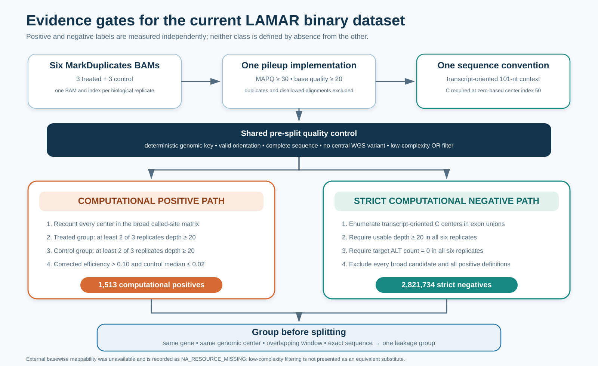

# Dry lab: evidence-aware labels for AI-guided RNA editing

> **Takeaway:** We measured both candidate editing and candidate non-editing directly, then used sequence alone to train LAMAR.

ORCA combines programmable PUF recognition with APOBEC-mediated C-to-U RNA editing. The experimental challenge is deciding which cytosines should be tested first. Our dry-lab workflow constructs auditable computational labels for this prioritization problem.

The current workflow replaces the earlier called-site funnel. A site is not a negative merely because REDItools did not call it. Strict negatives must have measurable RNA coverage and zero observed target-ALT reads in every treated and control replicate.

## Biological question

> **Can the 101-nucleotide context around a cytosine identify candidates worth testing with PUF–APOBEC editors?**

The prediction unit is a transcript-oriented sequence centered on C. The output is a candidate-ranking score for experimental prioritization. It is not a predicted editing efficiency or a substitute for wet-lab validation.

## Input evidence

Three treated and three control RNA-seq samples were analysed independently.

| Condition | Replicate | Sample | SRA accession |
|---|---:|---|---|
| Treated | 1 | CU517_GC_T1 | SRR27885768 |
| Treated | 2 | CU517_GC_T2 | SRR27885766 |
| Treated | 3 | CU517_GC_T3 | SRR27885765 |
| Control | 1 | CU517_GC_C1 | SRR27885767 |
| Control | 2 | CU517_GC_C2 | SRR27885764 |
| Control | 3 | CU517_GC_C3 | SRR27885763 |

The final binary dataset used one MarkDuplicates BAM and one readable index for each sample. All six files were recounted with the same filtering and pileup implementation.

## Current positive and negative mechanism

> **Takeaway:** Positive and negative labels follow separate evidence gates, followed by the same variant and sequence-quality rules.



**Figure 1 | Evidence gates for the current LAMAR binary dataset.** Positive candidates came from the broad called-site matrix and were recounted in six BAMs. Strict negatives came from expressed exon cytosines and required complete evidence of zero target-ALT reads. Equal-width paths indicate different label definitions; box area does not represent site count.

The source values and figure provenance are available in [figure_source_data.tsv](assets/figure_source_data.tsv) and [the provenance record](assets/figure1_current_binary_label_design.provenance.json).

### Unified pileup rules

The positive and negative paths used the same read-counting semantics:

- mapping quality at least 30;
- base quality at least 20;
- unmapped, secondary, QC-failed, duplicate-flagged, and supplementary alignments excluded;
- paired-end overlaps prevented from contributing duplicate evidence;
- usable depth defined as the filtered A, C, G, and T total;
- minimum qualifying usable depth of 20.

Each site retained sample-level usable depth, reference count, target-ALT count, other-ALT count, and target editing rate.

### Transcript orientation

Positive-strand transcript editing appears as genomic C-to-T. Negative-strand transcript editing appears as genomic G-to-A because the transcript is reverse-complemented.

Every model sequence was normalized to transcript orientation. It contained 101 nucleotides and required C at zero-based index 50. Ambiguous orientation, incomplete sequence, N-containing sequence, and an invalid center base caused exclusion.

## Computational positives

> **Takeaway:** A positive required a treated-minus-control signal above 0.10, not simply an editing call in one sample.

For each site, the workflow calculated treated and control replicate rates, group medians, median absolute deviations, and:

```text
raw_difference = treated_median - control_median
corrected_editing_efficiency = max(raw_difference, 0)
```

A site entered `positive_main` only when:

1. corrected editing efficiency was strictly greater than 0.10;
2. at least two of three treated replicates had usable depth at least 20;
3. at least two of three control replicates had usable depth at least 20;
4. the control median editing rate was at most 0.02;
5. orientation, sequence, WGS, and low-complexity checks passed.

The frozen dataset contained **1,513 computational positives**. The **1,457-site high-confidence subset** additionally required all-six coverage, screening BH-FDR below 0.05, treated MAD at most 0.05, and control MAD at most 0.02.

The pooled-read p-value and BH-FDR are screening statistics. They do not constitute biological-replicate validation or experimental confirmation.

## Strict computational negatives

> **Takeaway:** A strict negative was expressed and deeply covered, yet showed zero target-ALT reads in all six samples.

Transcript-oriented C centers were enumerated from the GENCODE v50 primary-assembly exon union. Positive-strand transcripts contributed genomic C sites, while negative-strand transcripts contributed genomic G sites that normalized to transcript C.

A site entered the strict negative universe only when:

1. all six samples had usable depth at least 20;
2. all six target-ALT counts were exactly zero;
3. all six target editing rates were therefore zero;
4. the site was absent from every positive definition and the broad called-candidate matrix;
5. orientation, sequence, WGS, and low-complexity checks passed.

The frozen universe contained **2,821,734 strict computational negatives**. These are computational negatives with direct expression and coverage evidence. They are not experimentally proven non-editable cytosines.

## Shared exclusion rules

> **Takeaway:** The same central-variant and sequence-complexity checks were applied before data splitting.

A site was excluded when its genomic center occurred in either HEK293T WGS resource, regardless of the reported alternative allele.

Low complexity used an OR rule on the complete 101-nucleotide context:

- base-2 single-nucleotide Shannon entropy below 1.20;
- any homopolymer run at least 20 nucleotides;
- deterministic dinucleotide-repeat coverage at least 0.80 in either repeat phase.

Excluded records and trigger reasons were retained for audit. External basewise mappability was unavailable and remains `NA_RESOURCE_MISSING`. Low-complexity filtering is not described as an equivalent mappability test.

## Leakage-aware dataset splitting

> **Takeaway:** Related biological and sequence examples were grouped before train, development, calibration, and held-out assignments.

Any shared gene, genomic center, overlapping same-strand window, or exact 101-nucleotide sequence forced examples into the same leakage group. Splitting was performed on these groups rather than individual rows.

| Split | Computational positives | Intended use |
|---|---:|---|
| Train | **1,028** | Model fitting and train-only negative sampling |
| Development | **159** | Architecture and configuration selection |
| Calibration | **165** | Probability calibration and threshold analysis |
| Held-out test | **161** | Frozen final evaluation |

The public release audited zero cross-split overlap by gene, leakage group, genomic key, and exact sequence.

## Negative sampling for model training

The complete strict negative universe was retained. Training did not relabel uncovered sites or copy negatives to achieve a target ratio.

The final ensemble combined members trained with random strict negatives and members trained with a 50:50 mixture of random and NC-matched strict negatives. The matched component followed GC 60%, TC 28%, CC 8%, and AC 4%. PUF motif status was not used to define a negative.

Coverage, expression, annotation, and negative type supported filtering, matching, stratification, and auditing. The default LAMAR input remained the 101-nucleotide sequence alone.

## Why the earlier funnel was retired

The earlier figure summarized successive filters applied to a called-site universe. It was useful for reconstructing the first screening pipeline, but it did not define a complete negative population.

Presenting that funnel as the current model dataset would conflate three different concepts: called candidates, computational positives, and strict computational negatives. The historical counts remain in the [DBTL archive](../dbtl/README.md) and [legacy results](../results/README.md), but they are no longer the headline dataset figure.

## Scientific interpretation

The strongest supported conclusion is that the workflow constructed sequence-linked computational labels with explicit treated, control, coverage, variant, complexity, and leakage checks.

It does not establish that every computational positive is experimentally editable. It also does not establish that every strict computational negative is biologically impossible to edit. Prospective PUF–APOBEC experiments remain necessary.

## Reproducibility

- [Current binary label specification](../pipeline/LAMAR_BINARY_LABEL_DESIGN.md)
- [Figure source data](assets/figure_source_data.tsv)
- [Figure provenance](assets/figure1_current_binary_label_design.provenance.json)
- [Sample manifest](../pipeline/config/samples.tsv)
- [Historical DBTL record](../dbtl/README.md)
- [Legacy continuous-label route](../pipeline/LAMAR_TRAINING_LABELS.md)
- [Frozen binary dataset and model release](https://github.com/pdx12320/PUF_fine_tuning_version1)

## References

1. Lin, Y.-C. *et al.* Genome dynamics of the human embryonic kidney 293 lineage in response to cell biology manipulations. *Nature Communications* **5**, 4767 (2014).
2. Dobin, A. *et al.* STAR: ultrafast universal RNA-seq aligner. *Bioinformatics* **29**, 15–21 (2013).
3. McKenna, A. *et al.* The Genome Analysis Toolkit. *Genome Research* **20**, 1297–1303 (2010).
4. Picardi, E. and Pesole, G. REDItools. *Bioinformatics* **29**, 1813–1814 (2013).
5. McLaren, W. *et al.* The Ensembl Variant Effect Predictor. *Genome Biology* **17**, 122 (2016).
