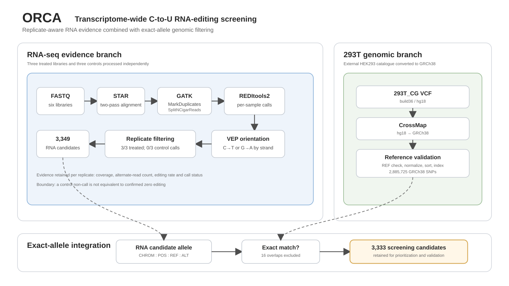
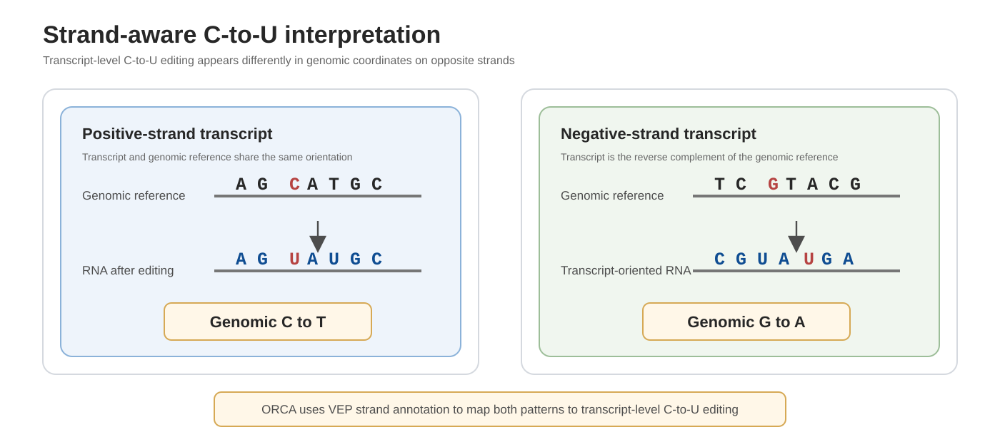
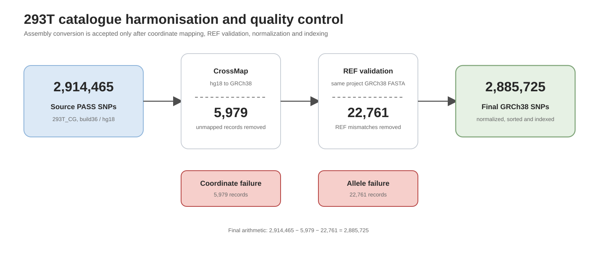
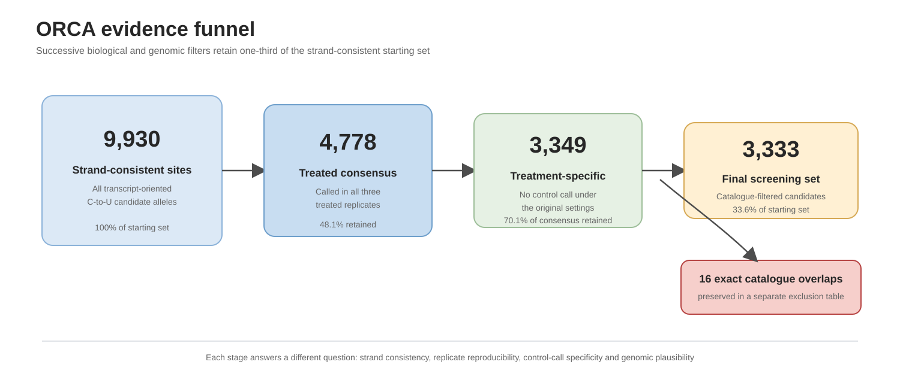

# ORCA Dry Lab — Transcriptome-wide C-to-U RNA-editing screening

## Overview

ORCA is our dry-lab system for screening transcriptome-wide C-to-U RNA-editing signals. It combines three treated and three control RNA-seq libraries with an assembly-harmonized 293T genomic-variant catalogue.

The goal is to identify signals that are reproducible after treatment, not called in controls under the same settings, consistent with transcript strand, and not readily explained by known 293T genomic variation.

## Input data

| Condition | Replicate | Sample | SRA accession |
|---|---:|---|---|
| Treated | 1 | CU517_GC_T1 | SRR27885768 |
| Treated | 2 | CU517_GC_T2 | SRR27885766 |
| Treated | 3 | CU517_GC_T3 | SRR27885765 |
| Control | 1 | CU517_GC_C1 | SRR27885767 |
| Control | 2 | CU517_GC_C2 | SRR27885764 |
| Control | 3 | CU517_GC_C3 | SRR27885763 |

Each library was processed independently so that replicate support remained visible.

## Workflow



**Figure 1 | ORCA system overview.** RNA-seq evidence and the harmonized 293T catalogue are integrated by exact allele to produce the final screening set.

```text
RNA-seq alignment and preprocessing
→ REDItools2 substitution calling
→ VEP transcript-strand interpretation
→ treated and control comparison
→ 293T catalogue harmonization
→ exact CHROM:POS:REF:ALT filtering
```

### 1. RNA-seq alignment and preprocessing

Paired-end reads were aligned to the GRCh38 primary assembly with STAR in two-pass mode.<sup>2</sup> GATK `MarkDuplicates` recorded duplicates, and `SplitNCigarReads` processed reads spanning splice junctions.<sup>3</sup>

### 2. Substitution calling

REDItools2 was run independently for all six libraries.<sup>4</sup>

| Parameter | Function |
|---|---|
| `-S` | report positions containing substitutions |
| `-me 20` | require at least 20 edited reads for a reported call |
| mapping quality >=20 | remove poorly mapped reads |
| base quality >=30 | remove low-confidence bases |

These settings favour strongly supported calls and may miss low-frequency editing.

### 3. Transcript-oriented interpretation



**Figure 2 | Strand-aware interpretation.** Transcript-level C-to-U editing appears as genomic C-to-T on positive-strand transcripts and genomic G-to-A on negative-strand transcripts.

VEP supplied transcript orientation.<sup>5</sup> Candidates inconsistent with transcript-level C-to-U editing were removed, while conflicting transcript orientations were treated as ambiguous.

### 4. Replicate and control filtering

A candidate entered the treatment-specific table when it was:

```text
called in all three treated replicates
AND not called in any control replicate
AND consistent with transcript-level C-to-U editing
```

The final tables preserve replicate-level coverage, alternate-read count and editing rate.

### 5. 293T catalogue harmonization

The `293T_CG` catalogue from the HEK293 Genome Project was generated on build36/hg18 coordinates.<sup>1</sup> ORCA converted it to GRCh38, removed unmapped records, checked REF alleles against the project FASTA, normalized the VCF, sorted it and created a tabix index.



**Figure 3 | Catalogue quality control.** The final reference-compatible catalogue contains 2,885,725 GRCh38 SNPs.

| Processing stage | Variant count |
|---|---:|
| Source PASS biallelic SNPs | 2,914,465 |
| CrossMap-unmapped records | 5,979 |
| GRCh38 REF mismatches removed | 22,761 |
| Final GRCh38 PASS biallelic SNPs | 2,885,725 |

### 6. Exact-allele integration

RNA candidates were compared with the catalogue using exact:

```text
CHROM : POS : REF : ALT
```

Coordinate-only matching was avoided because different alternate alleles can occur at the same position. Catalogue matches were written to a separate exclusion table rather than removed silently.

## Results



**Figure 4 | ORCA evidence funnel.** Successive filters reduced 9,930 strand-consistent candidates to 3,333 catalogue-filtered screening candidates.

| Evidence layer | Number of sites |
|---|---:|
| Strand-consistent site matrix | 9,930 |
| Called in all three treated replicates | 4,778 |
| Treatment-specific before catalogue comparison | 3,349 |
| Exact 293T catalogue overlaps | 16 |
| Final catalogue-filtered screening candidates | 3,333 |

The 16 exact catalogue matches remain available in a separate exclusion table. The 3,333 retained sites form the final ORCA screening set for prioritization and experimental validation.

## Contribution

ORCA provides:

1. replicate-aware analysis of three treated and three control libraries;
2. transcript-strand-aware C-to-U interpretation;
3. a reproducible hg18-to-GRCh38 293T catalogue conversion;
4. exact-allele genomic filtering;
5. separate retained, excluded and summary outputs;
6. ten documented DBTL cycles covering analysis, implementation and evidence boundaries.

## Limitations

The frozen legacy result does not contain independent candidate-site depth and base counts for control non-calls. A missing control call is therefore not proof of zero editing.

The 293T catalogue is external to the exact experimental cell batch. Absence from the catalogue does not prove that a retained site is free of a subline-specific genomic variant.

RNA-seq mismatches may also arise from alignment ambiguity, sequencing artefacts, repetitive sequence or endogenous modification. Orthogonal validation remains necessary.

The stringent edited-read threshold favours specificity and may miss low-frequency editing.

## Reproducibility

- `pipeline/` contains executable code and commands.
- `dbtl/` contains ten development cycles, failure logs and decisions.
- `results/` contains the frozen count summary.
- `pipeline/CATALOGUE_PROVENANCE.md` records catalogue source and quality control.

## References

1. Lin, Y.-C. *et al.* Genome dynamics of the human embryonic kidney 293 lineage in response to cell biology manipulations. *Nature Communications* **5**, 4767 (2014).
2. Dobin, A. *et al.* STAR: ultrafast universal RNA-seq aligner. *Bioinformatics* **29**, 15–21 (2013).
3. McKenna, A. *et al.* The Genome Analysis Toolkit. *Genome Research* **20**, 1297–1303 (2010).
4. Picardi, E. and Pesole, G. REDItools. *Bioinformatics* **29**, 1813–1814 (2013).
5. McLaren, W. *et al.* The Ensembl Variant Effect Predictor. *Genome Biology* **17**, 122 (2016).
6. Zhao, H. *et al.* CrossMap. *Bioinformatics* **30**, 1006–1007 (2014).
7. Danecek, P. *et al.* Twelve years of SAMtools and BCFtools. *GigaScience* **10**, giab008 (2021).
